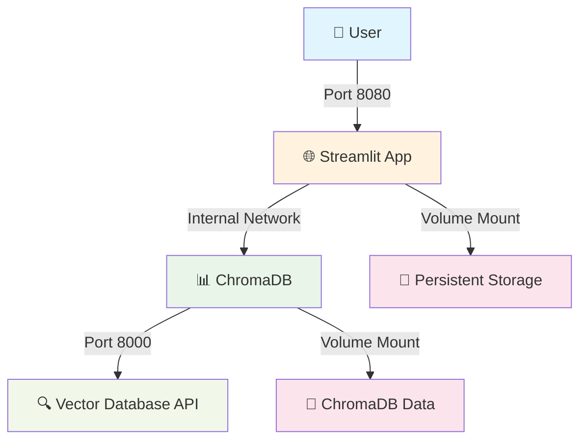
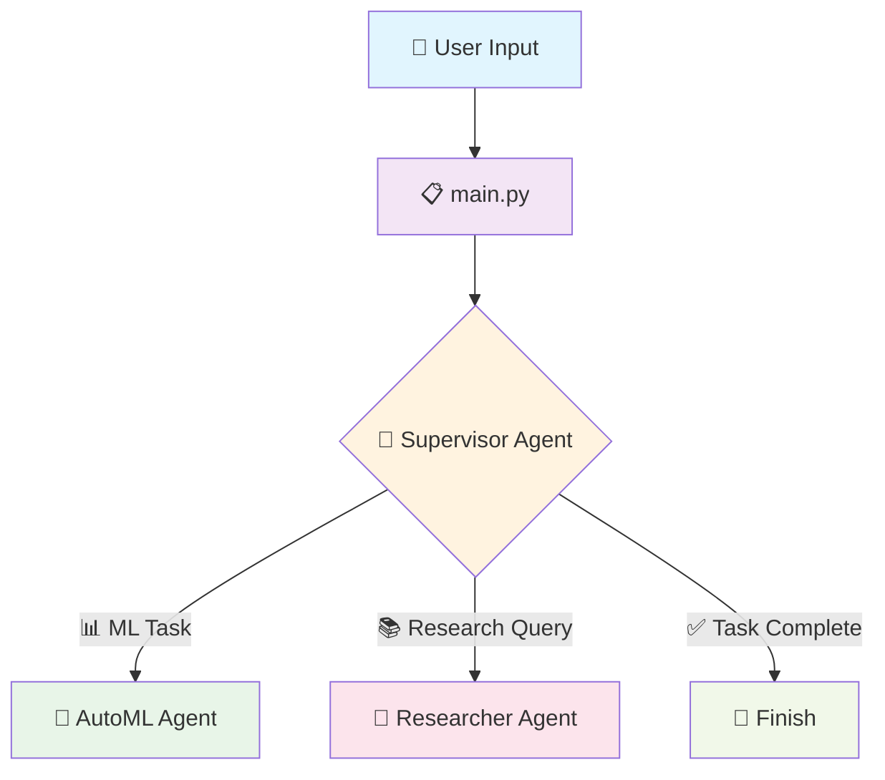
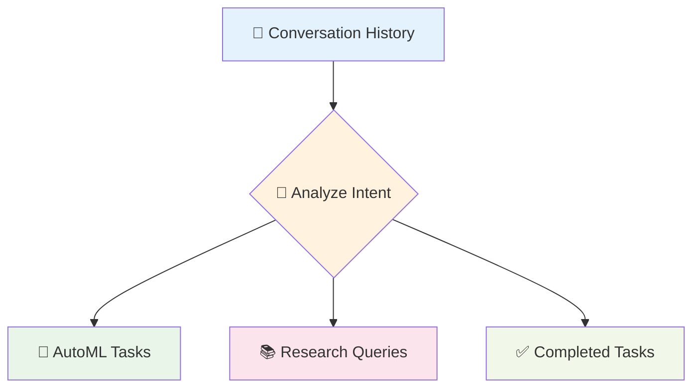
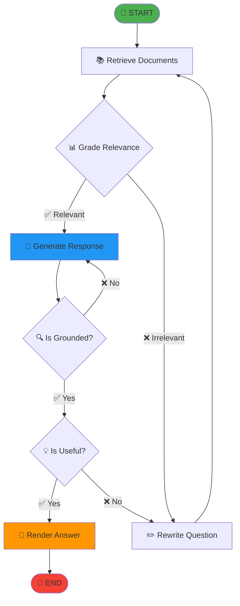
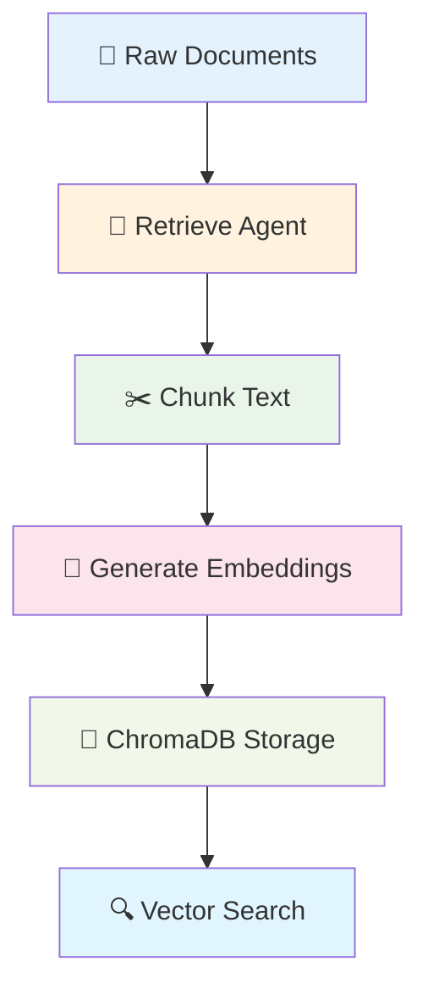
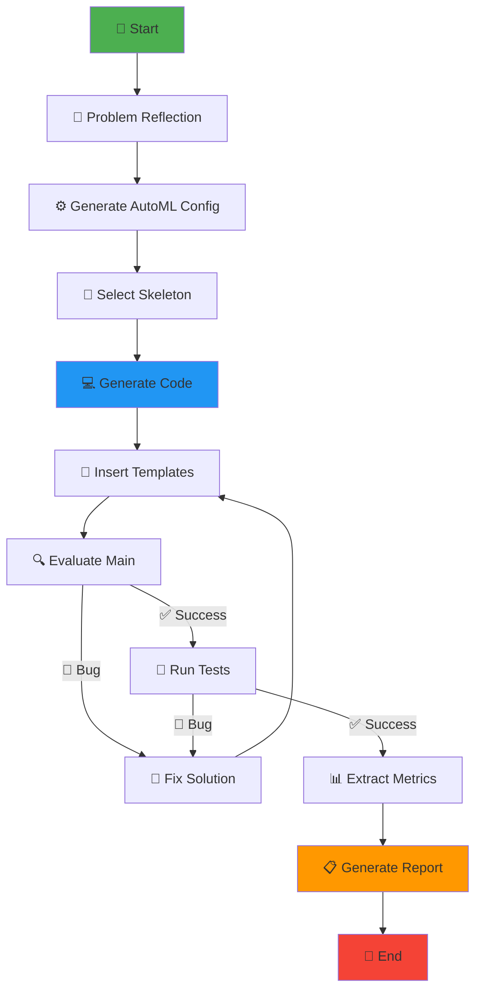
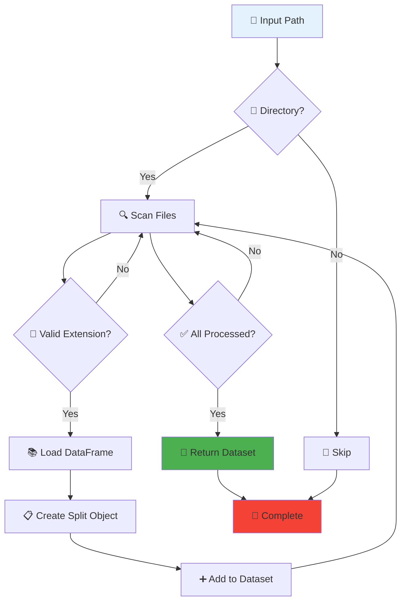
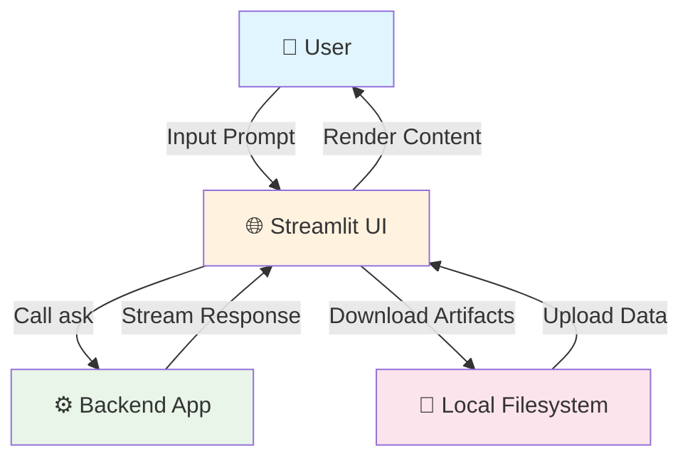
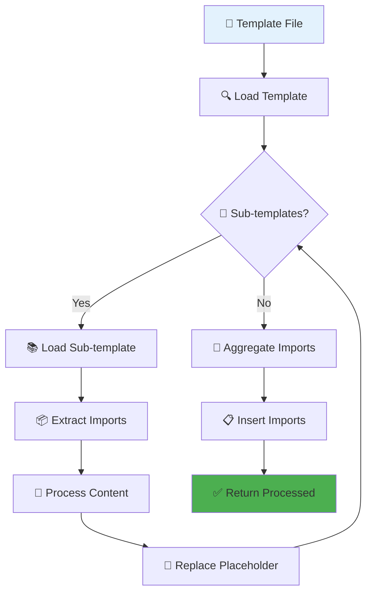

# 🤖 FEDOT.LLM Documentation

<div align="center">

*Intelligent AI Assistant for Automated Machine Learning*

[](https://github.com/aimclub/FEDOT.LLM/blob/main/docs/wiki-eng-beautiful.md)  
[](https://github.com/aimclub/FEDOT.LLM/blob/main/docs/wiki-ru-beautiful.md)

[](https://python.org)
[](https://openai.com)
[](https://github.com/aimclub/FEDOT)
[](https://streamlit.io)

[](https://github.com/aimclub/FEDOT.LLM)


</div>

---

## 📋 Table of Contents

<details>
<summary><b>🎯 Getting Started</b></summary>

- [🔍 Project Overview](#-project-overview)
- [⚙️ Installation and Setup](#%EF%B8%8F-installation-and-setup)
  - [📦 Basic Installation](#-basic-installation)
    - [🚀 Method 1: Using uv (Recommended)](#-method-1-using-uv-recommended)
    - [🐍 Method 2: Using conda](#-method-2-using-conda)
  - [🔧 Environment Configuration](#-environment-configuration)
- [🐳 Docker Setup](#-docker-setup)
  - [📋 Docker Prerequisites](#-docker-prerequisites)
  - [🚀 Quick Start with Docker](#-quick-start-with-docker)
  - [🏗️ Docker Architecture](#%EF%B8%8F-docker-architecture)
  - [🛠️ Makefile Commands Reference](#%EF%B8%8F-makefile-commands-reference)
  - [🔄 Development Workflow](#-development-workflow)
  - [🐛 Troubleshooting](#-troubleshooting)

</details>

<details>
<summary><b>🏗️ Architecture & Components</b></summary>

- [🏛️ Overall System Architecture](#%EF%B8%8F-overall-system-architecture)
  - [🔄 Main Application Flow](#-main-application-flow)
  - [🤖 Agent System](#-agent-system)
    - [👨‍💼 Supervisor Agent](#-supervisor-agent)
    - [🔬 Researcher Agent](#-researcher-agent)
    - [💾 Data Management and Memory](#-data-management-and-memory)
    - [🧠 AutoML Agent](#-automl-agent)

</details>

<details>
<summary><b>📊 Data & Interface</b></summary>

- [📈 Data Loading and Representation](#-data-loading-and-representation)
- [🌐 Streamlit Web Interface](#-streamlit-web-interface)
- [🎨 Template System](#-template-system)

</details>

---

## 🔍 Project Overview

<div align="center">

> **🚀 Revolutionizing Machine Learning with Intelligent AI Agents**

</div>

**FEDOT.LLM** is a cutting-edge project that harnesses the power of **Large Language Models (LLMs)** to transform automated machine learning (AutoML) tasks and research assistance. At its core lies an intelligent system that understands, adapts, and delivers sophisticated machine learning solutions through natural language interaction.

### ✨ Key Features

<table>
<tr>
<td width="50%">

**🤖 Intelligent Agent System**
- **Supervisor Agent**: Central coordination and task routing
- **Researcher Agent**: Documentation understanding and grounded responses
- **AutoML Agent**: Automated ML pipeline generation and optimization

</td>
<td width="50%">

**🔧 Advanced Capabilities**
- **Natural Language Processing**: Understand complex ML requirements
- **Code Generation**: Automatic Python code creation for ML pipelines
- **Interactive Web Interface**: Streamlit-based conversational UI

</td>
</tr>
<tr>
<td width="50%">

**📊 Data Management**
- **Multi-format Support**: CSV, Parquet, Excel, ARFF
- **Vector Database**: ChromaDB for efficient document retrieval
- **Memory Management**: Context-aware information storage

</td>
<td width="50%">

**🎯 Use Cases**
- **AutoML Solutions**: End-to-end ML pipeline development
- **Research Assistance**: Documentation-based question answering
- **Educational Support**: Learning ML concepts through interaction

</td>
</tr>
</table>

### 🎯 Core Philosophy

The system operates on a **modular, agent-based architecture** that enables:

- 🔄 **Dynamic Adaptation**: Automatic adjustment to problem requirements
- 🔁 **Iterative Refinement**: Continuous improvement of solutions
- 🏗️ **Scalable Design**: Easy integration of new capabilities
- 🛡️ **Isolated Execution**: Safe code execution in sandboxed environments

### 🌟 What Makes FEDOT.LLM Special?

| Feature | Description | Benefit |
|---------|-------------|---------|
| 🧠 **LLM-Powered Intelligence** | Leverages state-of-the-art language models | Natural, intuitive interaction |
| 🔗 **Agent Orchestration** | Specialized agents for different tasks | Efficient, focused problem-solving |
| 📝 **Grounded Responses** | Documentation-based answer generation | Accurate, reliable information |
| ⚡ **Automated Workflows** | End-to-end ML pipeline automation | Rapid prototyping and deployment |
| 🎨 **Template System** | Flexible code and prompt generation | Consistent, maintainable outputs |

---

## ⚙️ Installation and Setup

<div align="center">

> **📦 Get up and running in minutes!**

</div>

### 📦 Basic Installation

We offer two installation methods to suit your preferences:

<div align="center">

| Method | Difficulty | Speed | Recommended |
|--------|------------|-------|-------------|
| 🚀 **uv** | Easy | ⚡ Ultra Fast | ✅ **Yes** |
| 🐍 **conda** | Easy | 🐌 Standard | ⚠️ Alternative |

</div>

#### 🚀 Method 1: Using uv (Recommended)

<details>
<summary><b>📋 Step-by-step installation with uv</b></summary>

**Step 1: Install uv**
> A blazingly fast Python package installer and resolver

```bash
curl -LsSf https://astral.sh/uv/install.sh | sh
```

**Step 2: Clone the repository**
```bash
git clone https://github.com/aimclub/FEDOT.LLM.git
cd FEDOT.LLM
```

**Step 3: Create and activate virtual environment**
```bash
uv venv --python 3.11
source .venv/bin/activate  # On Unix/macOS
# Or on Windows:
# .venv\Scripts\activate
```

**Step 4: Install dependencies**
```bash
uv sync
```

</details>

#### 🐍 Method 2: Using conda

<details>
<summary><b>📋 Step-by-step installation with conda</b></summary>

**Step 1: Create conda environment**
```bash
conda create -n FedotLLM python=3.11
conda activate FedotLLM
```

**Step 2: Clone the repository**
```bash
git clone https://github.com/aimclub/FEDOT.LLM.git
cd FEDOT.LLM
```

**Step 3: Install dependencies**
```bash
pip install -e .
```

</details>

### 🔧 Environment Configuration

<div align="center">

> **🔐 Secure your API access for optimal performance**

</div>

FEDOT.LLM requires API keys to access LLM services. Configure them through environment variables for seamless operation.

#### Option 1: Create `.env` file (Recommended)

Create a `.env` file in the project root:

```bash
# Required API Keys
FEDOTLLM_LLM_API_KEY=your_llm_api_key_here
FEDOTLLM_EMBEDDINGS_API_KEY=your_embeddings_api_key_here

# Optional: For tracing LLM calls with Langfuse
LANGFUSE_SECRET_KEY=your_langfuse_secret_key_here
LANGFUSE_PUBLIC_KEY=your_langfuse_public_key_here
```

#### Option 2: Export directly

```bash
export FEDOTLLM_LLM_API_KEY=your_llm_api_key_here
export FEDOTLLM_EMBEDDINGS_API_KEY=your_embeddings_api_key_here

# Optional: For tracing LLM calls with Langfuse
export LANGFUSE_SECRET_KEY=your_langfuse_secret_key_here
export LANGFUSE_PUBLIC_KEY=your_langfuse_public_key_here
```

<div align="center">

**🎉 Congratulations! You're ready to explore FEDOT.LLM**

</div>

---

## 🐳 Docker Setup

<div align="center">

> **🚀 Containerized Development and Deployment Made Simple**

</div>

FEDOT.LLM provides comprehensive Docker support with multi-container orchestration, development workflows, and production-ready configurations.

### 📋 Docker Prerequisites

Before starting, ensure you have the following installed:

| Tool | Version | Installation |
|------|---------|--------------|
| 🐳 **Docker** | 20.10+ | [Install Docker](https://docs.docker.com/get-docker/) |
| 🐙 **Docker Compose** | 2.0+ | [Install Compose](https://docs.docker.com/compose/install/) |
| 🛠️ **Make** | Any | Usually pre-installed on Unix systems |

### 🚀 Quick Start with Docker

#### 1. Clone and Setup
```bash
# Clone the repository
git clone https://github.com/aimclub/FEDOT.LLM.git
cd FEDOT.LLM

# Create environment file
cp .env.example .env
# Edit .env with your API keys
```

#### 2. Launch Services
```bash
# Build and start all services with development features
make docker-dev-build

# Or for a quick start without rebuild
make docker-dev
```

#### 3. Access Applications
- **🌐 Streamlit Web Interface**: [http://localhost:8080](http://localhost:8080)
- **📊 ChromaDB Vector Database**: [http://localhost:8000](http://localhost:8000)

### 🏗️ Docker Architecture

Our Docker setup includes multiple specialized containers:



### 🛠️ Makefile Commands Reference

#### 🏃 Development Commands
| Command | Description | Use Case |
|---------|-------------|----------|
| `make docker-dev` | Start development environment with watch mode | 🔄 Active development |
| `make docker-dev-build` | Build and start development environment | 🆕 First-time setup |
| `make docker-build` | Build all Docker images | 🔨 Manual builds |
| `make docker-run` | Start services with docker-compose | 🚀 Standard startup |

#### 📊 Monitoring Commands
| Command | Description | Use Case |
|---------|-------------|----------|
| `make docker-logs` | View all container logs | 🔍 Debugging |
| `make docker-logs-app` | View app container logs | 🌐 App debugging |
| `make docker-logs-chroma` | View ChromaDB logs | 📊 Database debugging |
| `make docker-ps` | Show running containers | 👀 Status check |

#### 🔧 Management Commands
| Command | Description | Use Case |
|---------|-------------|----------|
| `make docker-shell` | Access app container shell | 🐚 Interactive debugging |
| `make docker-shell-chroma` | Access ChromaDB container shell | 📊 Database management |
| `make docker-stop` | Stop all containers | ⏹️ Clean shutdown |
| `make docker-restart` | Restart containers | 🔄 Quick restart |

#### 🧹 Cleanup Commands
| Command | Description | Use Case |
|---------|-------------|----------|
| `make docker-clean` | Clean containers and images | 🧹 Regular cleanup |
| `make docker-clean-all` | **⚠️ Remove everything** | 🗑️ Complete reset |

### 🔄 Development Workflow

#### Daily Development Process
```bash
# Start your development session
make docker-dev-build

# Work on your code - changes auto-reload thanks to watch mode
# View logs if needed
make docker-logs-app

# Stop when done
make docker-stop
```

#### Testing and Quality Assurance
```bash
# Run tests in containerized environment
make docker-shell
uv run pytest

# Or run quality checks
make docker-shell
make lint
make test
```

### 📁 Volume Management

Our Docker setup uses persistent volumes for data storage:

| Volume | Purpose | Host Path | Container Path |
|--------|---------|-----------|----------------|
| 📊 **ChromaDB Data** | Vector database storage | `./docker/docker_caches/chroma` | `/docker_caches/chroma` |
| 💾 **Cache Storage** | General application cache | `./docker/docker_caches` | `/docker_caches` |

### 🌍 Environment Variables

Essential environment variables for Docker deployment:

```bash
# Required LLM API Configuration
FEDOTLLM_LLM_API_KEY=your_llm_api_key
FEDOTLLM_EMBEDDINGS_API_KEY=your_embeddings_api_key

# Optional Monitoring
LANGFUSE_SECRET_KEY=your_langfuse_secret
LANGFUSE_PUBLIC_KEY=your_langfuse_public

# ChromaDB Configuration (auto-configured)
IS_PERSISTENT=TRUE
PERSIST_DIRECTORY=/docker_caches/chroma
ANONYMIZED_TELEMETRY=FALSE
```

### 🔧 Advanced Configuration

#### Custom Port Configuration
```bash
# Modify docker-compose.yml for custom ports
services:
  app:
    ports:
      - "8090:8080"  # Custom Streamlit port
  chromadb:
    ports:
      - "8010:8000"  # Custom ChromaDB port
```

#### Production Optimization
```bash
# Use production Dockerfile
docker build -t fedotllm-prod -f docker/run.Dockerfile .

# Run with resource limits
docker run --memory=4g --cpus=2 fedotllm-prod
```

### 🐛 Troubleshooting

#### Common Issues and Solutions

| Issue | Solution |
|-------|----------|
| 🔴 **Port already in use** | `make docker-stop` and check for conflicting services |
| 🔴 **Build failures** | `make docker-clean` and retry with `make docker-build` |
| 🔴 **Permission errors** | Ensure Docker daemon is running and user has Docker permissions |
| 🔴 **Out of disk space** | `make docker-clean-all` to free up space |
| 🔴 **ChromaDB connection issues** | Check `make docker-logs-chroma` for database errors |

#### Debug Commands
```bash
# Check container status
make docker-ps

# Inspect container details
docker inspect fdlm-app
docker inspect fdlm-chroma

# Check network connectivity
docker network ls
docker network inspect fedotllm_fdlm-net
```

#### Performance Monitoring
```bash
# Monitor resource usage
docker stats

# Container-specific monitoring
docker stats fdlm-app fdlm-chroma
```

### 🚀 Production Deployment

For production environments, consider:

1. **🔒 Security**: Use secrets management for API keys
2. **📊 Monitoring**: Implement health checks and logging
3. **🔄 Load Balancing**: Use reverse proxy (nginx/traefik)
4. **💾 Persistence**: Configure external volume storage
5. **🔄 Updates**: Implement blue-green deployment strategies

---

## 🏛️ Overall System Architecture

<div align="center">

> **🔗 Intelligent Agent Orchestration for Advanced ML Solutions**

</div>

The **FEDOT.LLM** project represents a paradigm shift in automated machine learning, featuring an **intelligent, agent-based architecture** that seamlessly integrates large language models with sophisticated automation workflows.

### 🎯 Architecture Principles

<div align="center">

| Principle | Description | Benefit |
|-----------|-------------|---------|
| 🤖 **Agent-Based Design** | Specialized AI agents for different tasks | Focused expertise and efficient processing |
| 🔄 **Modular Architecture** | Separable, interchangeable components | Easy maintenance and extensibility |
| 🛡️ **Isolated Execution** | Sandboxed code execution environment | Security and reliability |
| 📊 **Vector-Based Memory** | ChromaDB for intelligent document retrieval | Context-aware responses |

</div>

### 🔄 Main Application Flow

The system orchestrates complex workflows through intelligent agent coordination:



### 🤖 Agent System

Our multi-agent system provides specialized intelligence for different domains:

#### 👨‍💼 Supervisor Agent

<div align="center">

**🧭 The Central Command & Control**

</div>

The **Supervisor Agent** acts as the intelligent orchestrator, analyzing conversation context and routing requests to appropriate specialists:



**Key Capabilities:**
- 🎯 **Intent Recognition**: Automatically determines task type
- 🔀 **Smart Routing**: Directs requests to optimal agents
- 📊 **Context Management**: Maintains conversation state

#### 🔬 Researcher Agent

<div align="center">

**📖 Documentation Expert & Knowledge Navigator**

</div>

The **Researcher Agent** specializes in providing accurate, grounded responses from documentation sources:



**Advanced Features:**
- 🔍 **Hallucination Detection**: Ensures factual accuracy
- 📑 **Source Citation**: Links answers to documentation
- 🔄 **Iterative Refinement**: Improves response quality
- 🎯 **Question Rewriting**: Optimizes retrieval effectiveness

#### 💾 Data Management and Memory

The system employs sophisticated data management using **ChromaDB** for vector-based storage:



#### 🧠 AutoML Agent

<div align="center">

**🎯 Automated Machine Learning Pipeline Expert**

</div>

The **AutoML Agent** transforms natural language descriptions into complete machine learning solutions:



**Workflow Capabilities:**
- 🧠 **Problem Understanding**: Interprets ML requirements
- 🔧 **Code Generation**: Creates executable Python pipelines
- 🐛 **Error Handling**: Automatic bug detection and fixing
- 📊 **Performance Evaluation**: Comprehensive metrics extraction
- 📋 **Report Generation**: Detailed solution documentation

---

## 📈 Data Loading and Representation

<div align="center">

> **📊 Comprehensive Support for Multiple Data Formats**

</div>

The `fedotllm.data` module provides robust data handling capabilities for various file formats:

### Supported File Formats

| Category | Extensions | Use Case |
|----------|------------|----------|
| 📄 **CSV** | `.csv` | Standard tabular data |
| 📦 **Parquet** | `.parquet`, `.pq` | Optimized columnar storage |
| 📊 **Excel** | `.xls`, `.xlsx`, `.xlsm`, `.xlsb`, `.odf`, `.ods`, `.odt` | Spreadsheet data |
| 🔢 **ARFF** | `.arff` | Weka-compatible format |

### Data Loading Process



---

## 🌐 Streamlit Web Interface

<div align="center">

> **💬 Conversational AI Interface for ML Solutions**

</div>

The FEDOT.LLM web interface provides an intuitive, chat-based experience for interacting with AI agents and managing ML workflows.

### Architecture Overview



### Key Components

#### 💬 Chat Interface
- **Real-time Streaming**: Live response generation
- **Message Management**: Conversation history tracking
- **File Handling**: Data upload and download capabilities
- **Error Handling**: Graceful exception management

#### 🛠️ Utility Functions
- **Session Management**: User-specific data isolation
- **File Operations**: Upload, download, and compression
- **Response Rendering**: Dynamic content display
- **Hash Generation**: Unique session identification

#### 📊 Graph Visualization
- **Interactive Diagrams**: Mermaid-based flowcharts
- **Pipeline Visualization**: ML workflow representation
- **Real-time Updates**: Dynamic graph rendering

---

## 🎨 Template System

<div align="center">

> **🔧 Flexible Code and Content Generation Framework**

</div>

The template system enables dynamic content generation for AI prompts and executable code:

### Core Features

#### Template Processing
- **🔗 Sub-template Resolution**: Nested template support
- **📦 Import Aggregation**: Automatic dependency management
- **🎨 Content Preservation**: Maintains code formatting and indentation

#### Placeholder Types

| Type | Syntax | Purpose |
|------|--------|---------|
| 🔗 **Sub-template** | `<%% template_name %%>` | Load and insert template files |
| 🏷️ **Variable** | `` | Direct variable substitution |

### Template Workflow



---

<div align="center">

## 🚀 Getting Started

Ready to dive in? Here's your next steps:

1. **📦 Install** FEDOT.LLM using our quick setup guide
2. **🔑 Configure** your API keys for LLM access
3. **🌐 Launch** the Streamlit interface
4. **💬 Start** your first AI conversation
5. **🤖 Explore** AutoML capabilities

### 🤝 Contributing

We welcome contributions! Check out our:
- 📋 [Issues](https://github.com/aimclub/FEDOT.LLM/issues)
- 🔄 [Pull Requests](https://github.com/aimclub/FEDOT.LLM/pulls)
- 📖 [Contributing Guidelines](https://github.com/aimclub/FEDOT.LLM/blob/main/CONTRIBUTING.md)

### 📞 Support

Need help? Reach out through:
- 💬 [GitHub Discussions](https://github.com/aimclub/FEDOT.LLM/discussions)
- 🐛 [Issue Tracker](https://github.com/aimclub/FEDOT.LLM/issues)
- 📧 [Email Support](mailto:support@fedot-llm.ai)

---

<div align="center">

**Made with ❤️ by the FEDOT.LLM Team**

[](https://github.com/aimclub/FEDOT.LLM)
[](https://github.com/aimclub/FEDOT.LLM)

</div>

</div>
