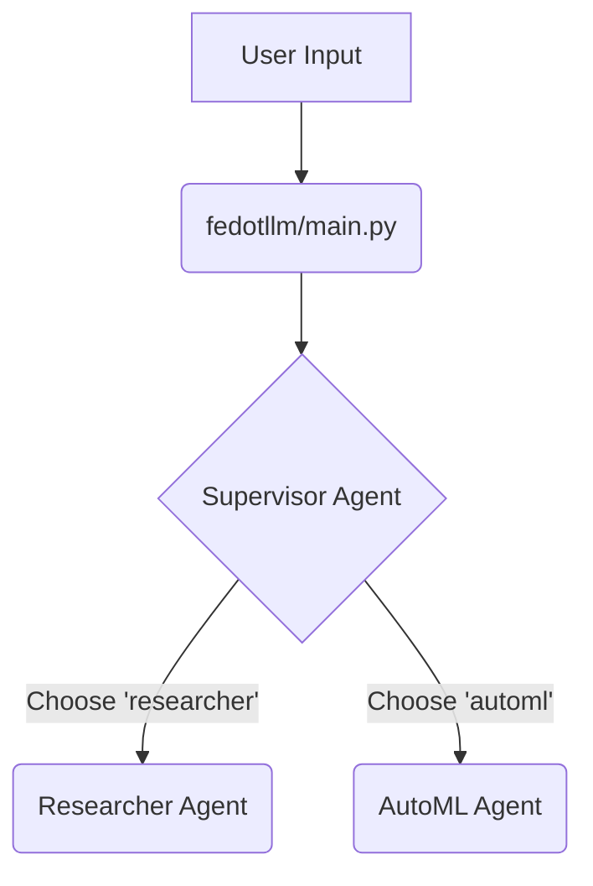
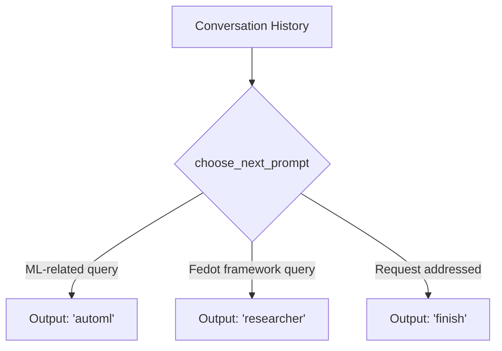
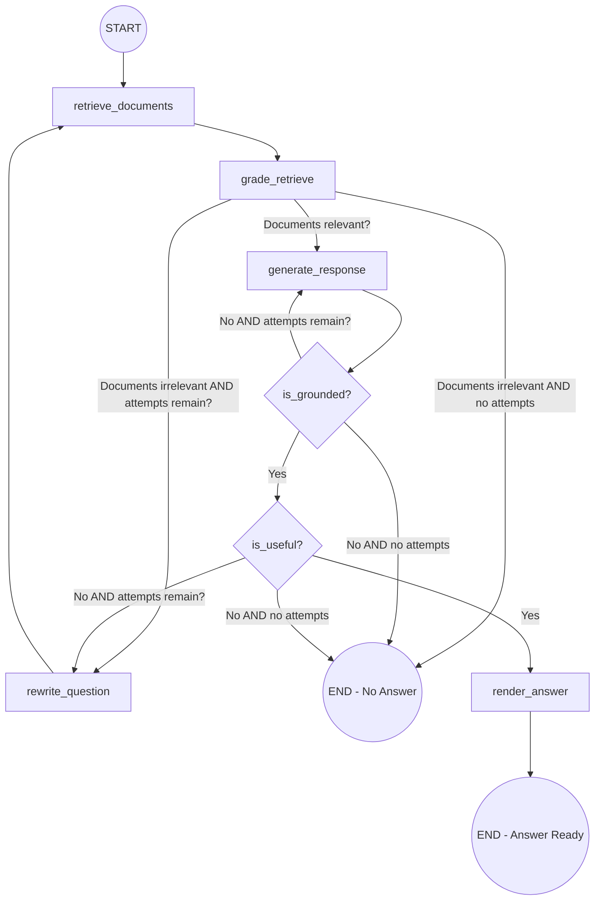
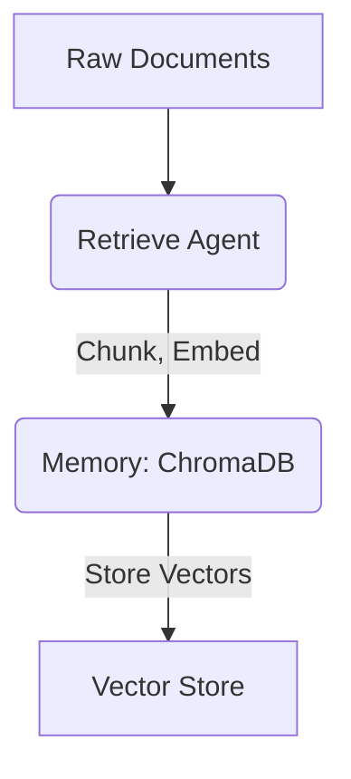
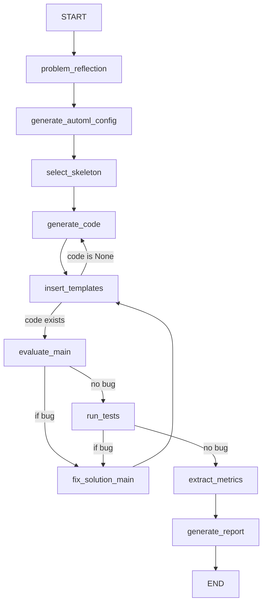
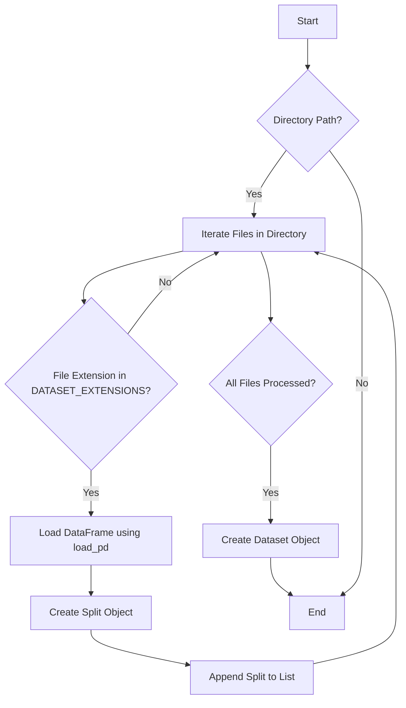
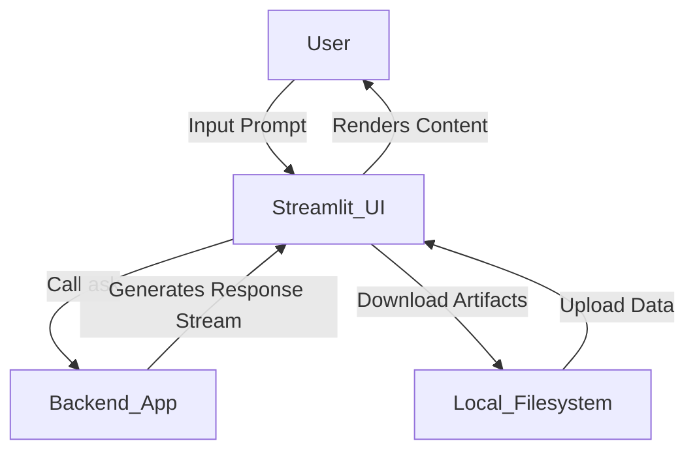
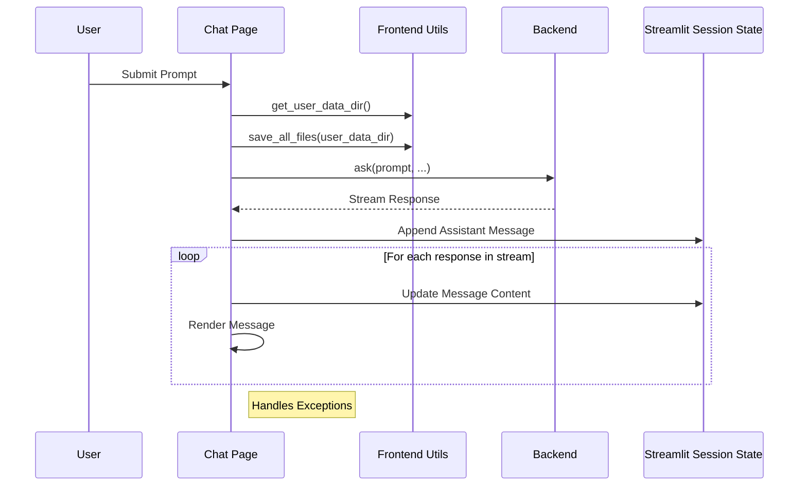
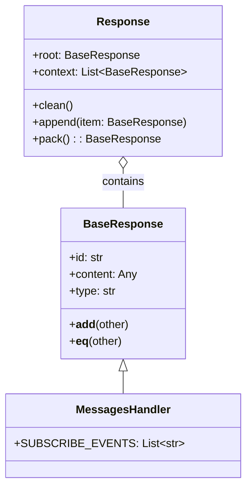
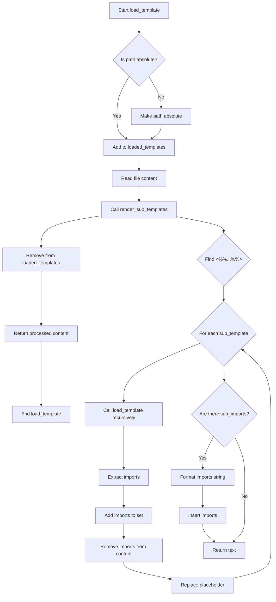

# FEDOT.LLM Documentation

<div align="center">

[](https://github.com/aimclub/FEDOT.LLM/blob/main/docs/wiki-ru.md) 
[](https://github.com/aimclub/FEDOT.LLM/blob/main/docs/wiki-eng.md)

</div>

---

## Table of Contents

- [Project Overview](#project-overview)
- [Installation and Setup](#installation-setup)
  - [Basic Installation](#basic-installation)
    - [Method 1: Using uv (Recommended)](#method-1-using-uv-recommended)
    - [Method 2: Using conda](#method-2-using-conda)
  - [Environment Configuration](#environment-configuration)
    - [Setting Up API Keys](#setting-up-api-keys)
- [Overall System Architecture](#overall-system-architecture)
  - [Main Application Flow](#main-application-flow)
  - [Agent System](#agent-system)
    - [Supervisor Agent](#supervisor-agent)
    - [Researcher Agent](#researcher-agent)
    - [Data Management and Memory](#data-management-and-memory)
    - [AutoML Agent](#automl-agent)
      - [Core Workflow and Architecture](#core-workflow-and-architecture)
      - [Reporting and Output Handling](#reporting-and-output-handling)
        - [AutoML Report Prompt Structure](#automl-report-prompt-structure)
- [Data Loading and Representation](#data-loading-and-representation)
    - [Supported File Formats](#supported-file-formats)
    - [Dataset Structure](#dataset-structure)
    - [Data Loading Process](#data-loading-process)
- [Streamlit Web Interface](#streamlit-web-interface)
  - [Architecture Overview](#architecture-overview)
  - [Key Components and Pages](#key-components-and-pages)
    - [Chat Interface](#chat-interface-fedotllmwebfrontendpageschatpy)
    - [Frontend Utility Functions](#frontend-utility-functions-fedotllmwebfrontendutils__init__py)
    - [Response Handling and Types](#response-handling-and-types-fedotllmwebcommontypespy)
    - [Graph Visualization](#graph-visualization-fedotllmwebfrontendcomponentsst_graphfrontendmainjs)
- [Template System](#template-system)
  - [Core Template Processing](#core-template-processing)
    - [Template Loading and Sub-Template Resolution](#template-loading-and-sub-template-resolution)
    - [Helper Functions for Template Processing](#helper-functions-for-template-processing)
    - [Placeholder Types](#placeholder-types)
  - [Template Rendering](#template-rendering)

<a id='project-overview'></a>


# Project Overview

FEDOT.LLM is a project designed to leverage large language models (LLMs) for automated machine learning (AutoML) tasks and research assistance, particularly in documentation understanding. It integrates various components including agents for specific tasks, data handling utilities, prompt management, and a local execution environment to facilitate complex machine learning workflows and interactive problem-solving. The system aims to streamline the process of building and evaluating ML models, as well as providing grounded answers from documentation.

The core of FEDOT.LLM revolves around intelligent agents that interact with LLMs, manage data, and execute code within isolated environments. This structure enables dynamic adaptation to problem requirements and iterative refinement of solutions, as seen in its researcher and AutoML functionalities.

# Installation and Setup

## Basic Installation
### Method 1: Using uv (Recommended)

1. Install uv (A fast Python package installer and resolver):

```bash
curl -LsSf https://astral.sh/uv/install.sh | sh
```

2. Clone the repository:

```bash
git clone https://github.com/aimclub/FEDOT.LLM.git
cd FEDOT.LLM
```

3. Create a new virtual environment and activate it:

```bash
uv venv --python 3.11
source .venv/bin/activate  # On Unix/macOS
# Or on Windows:
# .venv\Scripts\activate
```

4. Install dependencies:

```bash
uv sync
```

### Method 2: Using conda

1. Create a new conda environment:

```bash
conda create -n FedotLLM python=3.11
conda activate FedotLLM
```

2. Clone the repository:

```bash
git clone https://github.com/aimclub/FEDOT.LLM.git
cd FEDOT.LLM
```

3. Install dependencies:

```bash
pip install -e .
```

<a id='overall-architecture'></a>

## Environment Configuration
### Setting Up API Keys
FEDOT.LLM requires an API key to access LLM services. The key should be configured through environment variables.

Create a .env file in the root directory of the project or set the environment variable directly:
```bash
export FEDOTLLM_LLM_API_KEY=your_llm_api_key_here
export FEDOTLLM_EMBEDDINGS_API_KEY=your_embeddings_api_key_here

# Optional: For tracing LLM calls with Langfuse
export LANGFUSE_SECRET_KEY=your_langfuse_secret_key_here
export LANGFUSE_PUBLIC_KEY=your_langfuse_public_key_here
```

# Overall System Architecture

The FEDOT.LLM project is designed as an intelligent AI assistant capable of handling both documentation-related queries and automated machine learning (AutoML) tasks. Its architecture is fundamentally agent-based, leveraging large language models (LLMs) to process natural language requests, generate responses, and orchestrate complex workflows. The system employs a modular design, separating concerns into distinct agents, prompt definitions, data management, and execution environments to ensure scalability and maintainability.

At its core, FEDOT.LLM operates by routing user requests through a central `Supervisor` agent to specialized sub-agents like the `Researcher` for documentation inquiries or an `AutoML` agent for machine learning tasks. This structure allows for a flexible and extensible system where new capabilities can be integrated as additional agents. The system also incorporates robust data handling, including vector-based memory for context retrieval and a sandboxed execution environment for generated code.

## Main Application Flow

The main application flow begins with user interaction, typically through a web interface, where inputs such as uploaded files and task descriptions are received. The `main.py` script orchestrates the overall process, initializing the LLM and the agent workflow. User messages are processed, and a `Supervisor` agent is invoked to determine the appropriate subsequent action based on the conversation history. This decision dictates which specialized agent (e.g., Researcher or AutoML) will handle the request.

Here's a high-level representation of the main system flow:



## Agent System

The FEDOT.LLM architecture is built around a system of specialized agents, each responsible for a distinct set of tasks.

### Supervisor Agent

The `Supervisor` agent acts as the central routing mechanism, analyzing the conversation history to determine which specialized agent should handle the user's current request. It evaluates messages and decides whether the task pertains to general research/documentation (`researcher`), automated machine learning (`automl`), or if the conversation is concluded (`finish`).

The decision logic is encapsulated in the `choose_next_prompt` function, which takes the conversation messages as input and returns one of the predefined actions.

The `Supervisor` agent's workflow can be visualized as:


Sources: [fedotllm/prompts/supervisor.py:1-32](https://github.com/aimclub/FEDOT.LLM/blob/main/fedotllm/prompts/supervisor.py#L1-L32)

### Researcher Agent

The `Researcher` agent is designed to answer user questions by retrieving relevant information from provided documentation and generating grounded responses. Its workflow involves several steps, including generating an initial response, checking for grounding (hallucinations), assessing usefulness, and potentially rewriting the question for better retrieval.

The `Researcher` agent's workflow, as defined in [`fedotllm/agents/researcher/researcher.py`](https://github.com/aimclub/FEDOT.LLM/blob/main/fedotllm/agents/researcher/researcher.py) and implemented in [`fedotllm/agents/researcher/nodes.py`](https://github.com/aimclub/FEDOT.LLM/blob/main/fedotllm/agents/researcher/nodes.py), involves several steps to ensure a high-quality, grounded response:



* **`rewrite_question`**: Reformulates the user's initial question to improve retrieval effectiveness. This is based on the `rewrite_question_prompt`.
*   **`retrieve`**: Fetches relevant documents based on the (possibly rewritten) question using the `DocumentRetriever`.
*   **`generate_response`**: Combines the retrieved documents and the question to generate an initial answer using the `generate_prompt`.
*   **`is_grounded`**: Evaluates whether the generated answer is supported by the retrieved documents, using the `is_grounded_prompt`. This step helps prevent hallucinations.
*   **`is_useful`**: Assesses the utility and relevance of the generated answer to the original question, using the `is_useful_prompt`.
*   **`render_answer`**: Formats the final answer, incorporating citations from the documentation.
*   **`is_continue`**: A conditional node that checks if an attempt counter exists and increments it, potentially signaling a loop in the workflow.

#### Data Management and Memory

Data management within FEDOT.LLM is crucial for providing context-aware responses. The `Memory` component, specifically implemented using `ChromaDB`, serves as a vector database for storing and retrieving document chunks. The `Retrieve` agent is responsible for processing raw documents, chunking them, generating embeddings, and inserting them into this vector store.

The interaction between `Retrieve` and `Memory` can be conceptualized as:


Sources: [fedotllm/agents/retrieve.py:1-42](https://github.com/aimclub/FEDOT.LLM/blob/main/fedotllm/agents/retrieve.py#L1-L42), [fedotllm/agents/memory.py:4-31](https://github.com/aimclub/FEDOT.LLM/blob/main/fedotllm/agents/memory.py#L4-L31)


### AutoML Agent

The AutoML Agent within the FEDOT.LLM project is designed to automate the machine learning pipeline creation and execution process based on user requests. Its primary purpose is to interpret problem descriptions, generate appropriate AutoML configurations, produce executable code, evaluate its performance, and finally, generate a comprehensive report summarizing the solution. This agent acts as a core component for addressing automated machine learning tasks.

The agent operates through a defined workflow, processing user input through a series of interconnected steps, from initial problem understanding to final report generation. It leverages structured data models for problem definitions and integrates with a local execution environment for code validation and testing.

#### Core Workflow and Architecture

The `AutoMLAgent` defines a sequential and conditional workflow to guide the automated machine learning process. This workflow is compiled using a state machine-like approach, ensuring that steps are executed in a logical order, with built-in mechanisms for error handling and iteration.
Sources: [fedotllm/agents/automl/automl.py:1-33](https://github.com/aimclub/FEDOT.LLM/blob/main/fedotllm/agents/automl/automl.py#L1-L33)

The workflow includes distinct stages such as problem reflection, configuration generation, code creation, execution, testing, and reporting.


The workflow steps are:
*   **`problem_reflection`**: Initial analysis of the problem description.
*   **`generate_automl_config`**: Creates an AutoML configuration based on the reflection.
*   **`select_skeleton`**: Chooses a code skeleton for the solution.
*   **`generate_code`**: Generates the actual Python code for the ML pipeline.
*   **`insert_templates`**: Integrates generated code into templates. If the code is `None`, it loops back to `generate_code`.
*   **`evaluate_main`**: Executes the main part of the generated code. If a bug is detected (`if_bug` condition), it proceeds to `fix_solution_main`.
*   **`fix_solution_main`**: Attempts to fix bugs in the solution and returns to `insert_templates` for re-evaluation.
*   **`run_tests`**: Executes tests against the generated code. If a bug is detected, it goes to `fix_solution_main`.
*   **`extract_metrics`**: Extracts performance metrics from the executed solution.
*   **`generate_report`**: Compiles a final report based on the metrics and process.
Sources: [fedotllm/agents/automl/automl.py:21-33](https://github.com/aimclub/FEDOT.LLM/blob/main/fedotllm/agents/automl/automl.py#L21-L33)


#### Reporting and Output Handling

After the AutoML process completes, especially after metrics extraction, the agent generates a comprehensive report. This report is structured according to a specific prompt defined in [`fedotllm/prompts/automl.py`](https://github.com/aimclub/FEDOT.LLM/blob/main/fedotllm/prompts/automl.py). The display of this report, particularly in a Jupyter environment, is handled by the `JupyterOutput` class.

##### AutoML Report Prompt Structure

The `generate_report` prompt guides the language model in creating a detailed report about the AutoML solution. It specifies several sections and required information, including problem overview, pipeline summary, code highlights, metrics, and key takeaways.

| Section           | Description |
|-------------------|-------------|
| Problem Overview  | A summary of the problem being addressed, including key details and context. |
| Pipeline Summary   | An overview of the generated ML pipeline, including major components and their roles. |
| Code Highlights    | Key snippets of code that illustrate important aspects of the solution. |
| Metrics            | Performance metrics and evaluation results from the AutoML process. |
| Key Takeaways      | Important insights and conclusions drawn from the AutoML process. |


Sources: [fedotllm/prompts/automl.py:1-58](https://github.com/aimclub/FEDOT.LLM/blob/main/fedotllm/prompts/automl.py#L1-L58)

---

# Data Loading and Representation

The `fedotllm.data` module is responsible for abstracting the complexities of data loading and representing datasets consistently within the FEDOT.LLM ecosystem. It supports a variety of common tabular data formats.

### Supported File Formats

The system defines a set of recognized file extensions for datasets, allowing it to automatically identify and process them.

| Category   | Suffixes                               |
| :--------- | :------------------------------------- |
| CSV        | `.csv`                                 |
| Parquet    | `.parquet`, `.pq`                      |
| Excel      | `.xls`, `.xlsx`, `.xlsm`, `.xlsb`, `.odf`, `.ods`, `.odt` |
| ARFF       | `.arff`                                |

The `DATASET_EXTENSIONS` constant aggregates all these supported suffixes.

Sources: [fedotllm/constants.py:7](https://github.com/aimclub/FEDOT.LLM/blob/main/fedotllm/constants.py#L7)


### Dataset Structure

The `Dataset` class encapsulates one or more `Split` objects, each representing a DataFrame from a file. 
Sources: [fedotllm/data/data.py:1-24](https://github.com/aimclub/FEDOT.LLM/blob/main/fedotllm/data/data.py#L1-L24)

### Data Loading Process

The following diagram illustrates the general data loading process within the `fedotllm.data` module.



Sources: [fedotllm/data/data.py:1-9](https://github.com/aimclub/FEDOT.LLM/blob/main/fedotllm/data/data.py#L1-L9)


# Streamlit Web Interface

The FEDOT.LLM project provides an interactive web interface built using Streamlit, designed to offer a user-friendly experience for interacting with the underlying AI models and managing machine learning tasks. This interface allows users to describe their machine learning problems, upload datasets, receive AI-generated solutions, and download various output artifacts. It serves as the primary graphical user interface for the FEDOT.LLM system. 

The web interface facilitates a conversational approach to defining and solving ML problems, leveraging large language models (LLMs) to guide the process. It integrates components for chat-based interaction, dynamic content rendering, file management, and visualization of complex structures like pipelines.
## Architecture Overview

The Streamlit web interface operates by launching a local web server that serves the application. User interactions within the browser trigger Python functions defined in the Streamlit application, which in turn communicate with the FEDOT.LLM backend components. The frontend pages, such as the chat interface and sidebar, utilize shared utility functions for file handling and data management. Responses from the AI inference engine are processed and rendered dynamically. 

The core interaction flow involves the user providing a prompt, which is then sent to the `ask` function in the backend. The backend processes the request and streams responses back to the frontend, where they are displayed.



## Key Components and Pages

The Streamlit web interface is composed of several key pages and utility modules that collectively provide its functionality.

### Chat Interface ([`fedotllm/web/frontend/pages/chat.py`](https://github.com/aimclub/FEDOT.LLM/blob/main/fedotllm/web/frontend/pages/chat.py))

The `chat.py` file defines the main conversational interface where users interact with the FEDOT.LLM system. The `handle_predict` asynchronous function is central to processing user prompts and displaying AI responses. It manages the session state for messages and dynamically renders streamed content.

The `handle_predict` function performs the following sequence of operations:

Sources: [fedotllm/web/frontend/pages/chat.py:10-33](https://github.com/aimclub/FEDOT.LLM/blob/main/fedotllm/web/frontend/pages/chat.py#L10-L33)


### Frontend Utility Functions ([`fedotllm/web/frontend/utils/__init__.py`](https://github.com/aimclub/FEDOT.LLM/blob/main/fedotllm/web/frontend/utils/__init__.py))

This module aggregates various utility functions used across the Streamlit frontend. These functions primarily deal with file system operations, session management, and data handling.

| Function Name           | Description                                                                 |
|-------------------------|-----------------------------------------------------------------------------|
| `get_user_data_dir`     | Retrieves the directory path for user-specific data.                        |
| `clear_directory`       | Clears the contents of a specified directory.                               |
| `save_all_files`        | Saves all uploaded files to a designated directory.                         |
| `get_hash_key`          | Generates a hash key, likely for session or file identification.            |
| `file_uploader`         | Streamlit component wrapper for file uploads.                               |
| `create_zip_file`       | Compresses a directory or files into a zip archive.                         |
| `get_user_uploaded_files`| Retrieves a list of files uploaded by the user.                            |
| `get_user_session_id`   | Obtains the current user's session ID.                                      |
| `generate_output_file`  | Generates a specific output file, likely for submission.                    |
| `render`                | Renders content, specifically `BaseResponse` objects, in the UI.            |

### Response Handling and Types ([`fedotllm/web/common/types.py`](https://github.com/aimclub/FEDOT.LLM/blob/main/fedotllm/web/common/types.py))

The `types.py` file defines the data structures used for communication and content representation within the FEDOT.LLM system, particularly for responses streamed to the frontend. Key classes include `BaseResponse`, `Response`, and `MessagesHandler`.
Sources: [fedotllm/web/common/types.py:1-62](https://github.com/aimclub/FEDOT.LLM/blob/main/fedotllm/web/common/types.py#L1-L62)



Sources: [fedotllm/web/common/types.py:1-62](https://github.com/aimclub/FEDOT.LLM/blob/main/fedotllm/web/common/types.py#L1-L62)

`BaseResponse` serves as the fundamental unit for streamed content, allowing incremental updates and comparison of response parts. The `Response` class is a container for a root response and a list of context responses, providing methods to manage and pack them. `MessagesHandler` extends `BaseResponse` and defines a list of event types it subscribes to, indicating its role in processing specific system messages.

Sources: [fedotllm/web/common/types.py:1-62](https://github.com/aimclub/FEDOT.LLM/blob/main/fedotllm/web/common/types.py#L1-L62)

### Graph Visualization ([`fedotllm/web/frontend/components/st_graph/frontend/main.js`](https://github.com/aimclub/FEDOT.LLM/blob/main/fedotllm/web/frontend/components/st_graph/frontend/main.js))

It uses the `graphviz` library (implied) and interacts with the Streamlit component API to receive data from Python and update the displayed graph.

Sources: [fedotllm/web/frontend/components/st_graph/frontend/main.js:1-32](https://github.com/aimclub/FEDOT.LLM/blob/main/fedotllm/web/frontend/components/st_graph/frontend/main.js#L1-L32)

# Template System


# Template System

The FEDOT.LLM project incorporates a robust Template System designed to facilitate dynamic content generation, primarily for constructing sophisticated AI prompts and executable Python code snippets. This system enables the project to separate static content from dynamic variables, allowing for flexible and reusable structures. It handles nested templates, aggregates import statements, and preserves code indentation, ensuring that generated outputs are syntactically correct and readable. The system plays a vital role in the automated machine learning (AutoML) agent's ability to generate custom solutions and in the researcher agent's prompt formulation.

## Core Template Processing

The core of the template system resides in `load_template.py`, which provides functionalities for loading template files, resolving sub-templates, and managing Python import statements. This ensures that complex templates composed of smaller, reusable parts are correctly assembled into a single, coherent output.

### Template Loading and Sub-Template Resolution

The `load_template` function is responsible for reading a template file from the filesystem, processing any nested templates within it, and handling circular dependencies. It leverages `render_sub_templates` to perform the actual substitution and import aggregation. Sources: [fedotllm/agents/automl/templates/load_template.py:100-125](https://github.com/aimclub/FEDOT.LLM/blob/main/fedotllm/agents/automl/templates/load_template.py#L100-L125)


The `render_sub_templates` function is the workhorse for replacing sub-template placeholders (e.g., `<%% template_name %%>`) with their corresponding content. It recursively loads sub-templates, extracts their import statements, and then removes them from the sub-template content before insertion. The extracted imports are then aggregated and inserted at the top of the final rendered content. Sources: [fedotllm/agents/automl/templates/load_template.py:53-97](https://github.com/aimclub/FEDOT.LLM/blob/main/fedotllm/agents/automl/templates/load_template.py#L53-L97)


The overall flow for processing a template file is as follows:


Sources: [fedotllm/agents/automl/templates/load_template.py:53-125](https://github.com/aimclub/FEDOT.LLM/blob/main/fedotllm/agents/automl/templates/load_template.py#L53-L125)

### Helper Functions for Template Processing

Several helper functions support the main template processing logic:

*   `_extract_imports(content: str) -> Set[str]`: Identifies and extracts `import` and `from ... import` statements using a regular expression. Sources: [fedotllm/agents/automl/templates/load_template.py:99-105](https://github.com/aimclub/FEDOT.LLM/blob/main/fedotllm/agents/automl/templates/load_template.py#L99-L105)
*   `_remove_imports(content: str, imports: Set[str]) -> str`: Removes the identified import statements from the content. Sources: [fedotllm/agents/automl/templates/load_template.py:107-115](https://github.com/aimclub/FEDOT.LLM/blob/main/fedotllm/agents/automl/templates/load_template.py#L107-L115)
*   `_replace_placeholder_with_content(text: str, placeholder: str, content: str) -> str`: Replaces a specific placeholder (`<%% placeholder %%>`) in the text with the provided content, critically preserving the original indentation of the placeholder. Sources: [fedotllm/agents/automl/templates/load_template.py:175-195](https://github.com/aimclub/FEDOT.LLM/blob/main/fedotllm/agents/automl/templates/load_template.py#L175-L195)
*   `_insert_imports(text: str, imports_str: str) -> str`: Inserts the aggregated import statements at the beginning of the text, after any initial comments. Sources: [fedotllm/agents/automl/templates/load_template.py:197-210](https://github.com/aimclub/FEDOT.LLM/blob/main/fedotllm/agents/automl/templates/load_template.py#L197-L210)

### Placeholder Types

The template system utilizes two primary types of placeholders for different purposes:

| Placeholder Type     | Purpose                                                 | Source File                                  |
| :------------------- | :------------------------------------------------------ | :------------------------------------------- |
| `<%% template_name %%>` | For loading and inserting content from sub-template files. | [fedotllm/agents/automl/templates/load_template.py:59](https://github.com/aimclub/FEDOT.LLM/blob/main/fedotllm/agents/automl/templates/load_template.py#L59) |
| ``          | For direct variable substitution within a string template. | [fedotllm/agents/automl/templates/load_template.py:221](https://github.com/aimclub/FEDOT.LLM/blob/main/fedotllm/agents/automl/templates/load_template.py#L221) |

## Template Rendering

Beyond the file-based template loading, the system also provides a `render_template` function for replacing simple variable placeholders (e.g., ``) within a given string template. This is used for direct string templating where file loading is not required. Sources: [fedotllm/agents/automl/templates/load_template.py:212-237](https://github.com/aimclub/FEDOT.LLM/blob/main/fedotllm/agents/automl/templates/load_template.py#L212-L237)