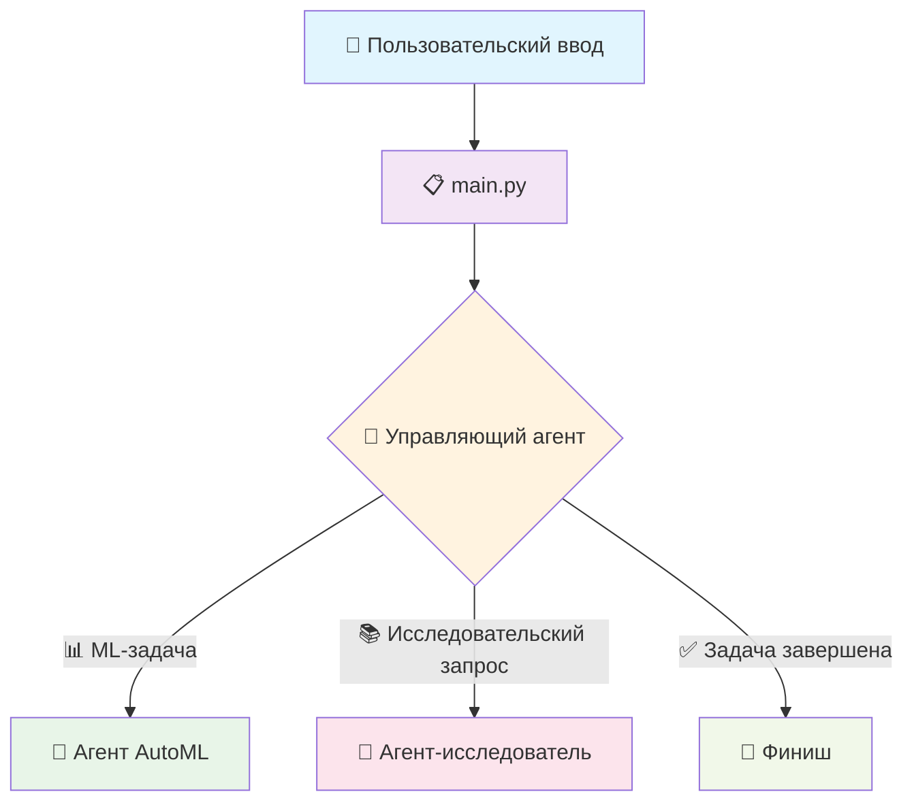
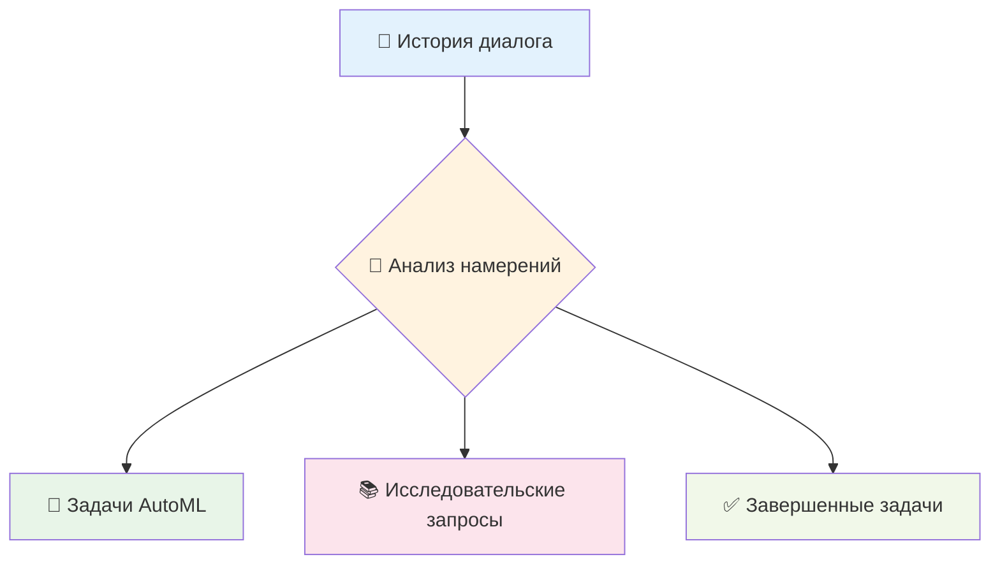
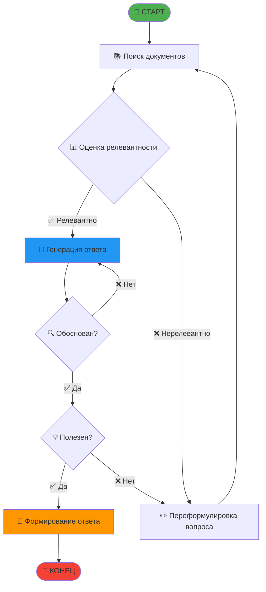
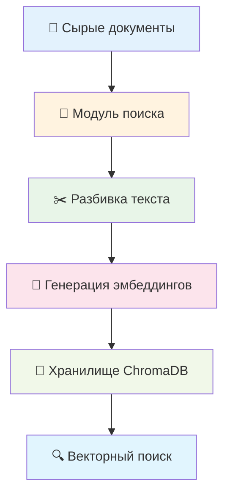
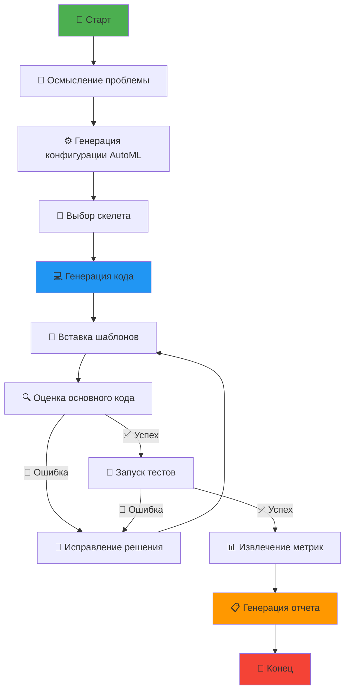
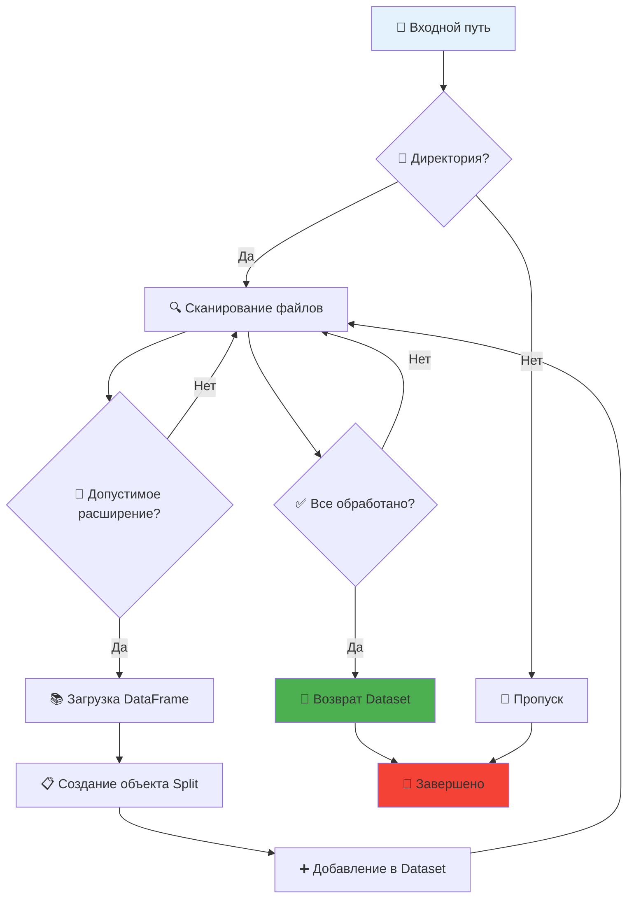
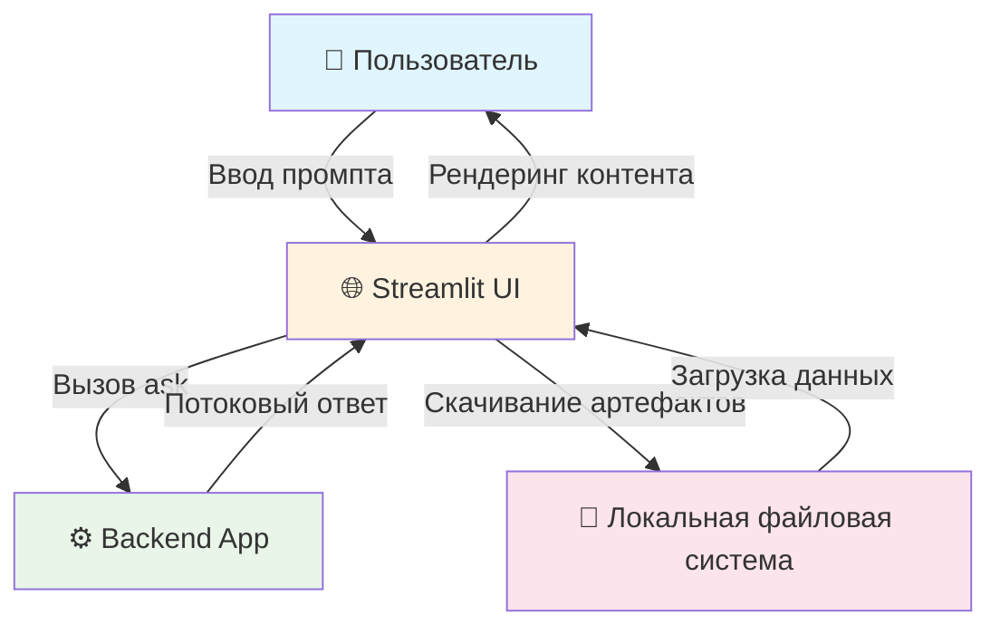
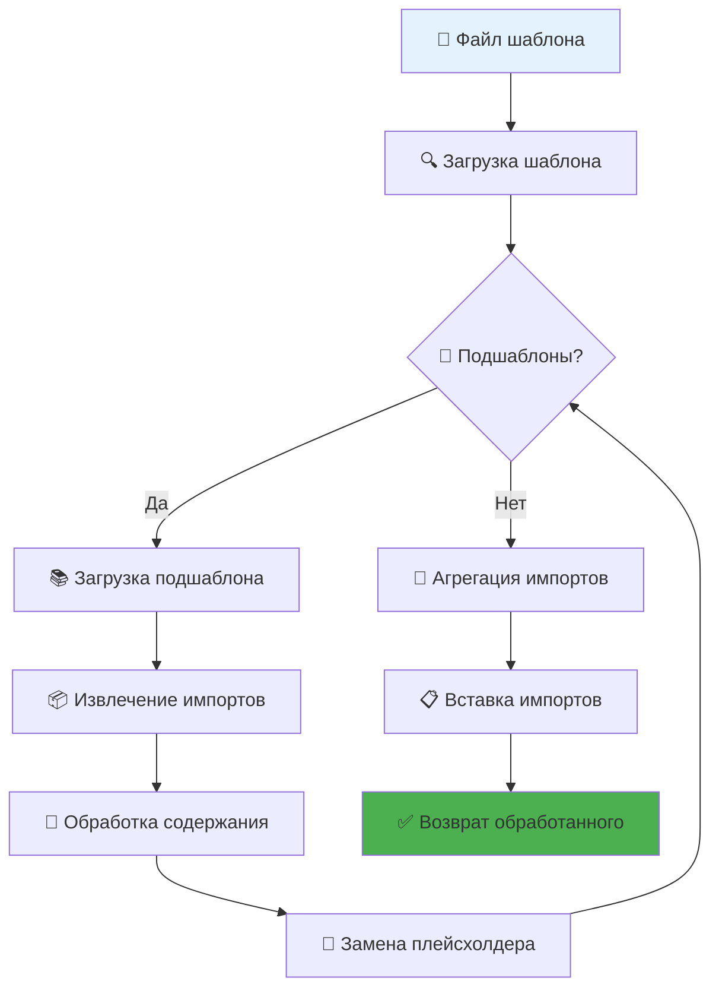

# 🤖 Документация FEDOT.LLM

<div align="center">

*Интеллектуальный ИИ-помощник для автоматического машинного обучения*

[](https://github.com/aimclub/FEDOT.LLM/blob/main/docs/wiki-ru.md)
[](https://github.com/aimclub/FEDOT.LLM/blob/main/docs/wiki-eng.md)

[](https://python.org)
[](https://openai.com)
[](https://github.com/aimclub/FEDOT)
[](https://streamlit.io)


</div>

---

## 📋 Содержание

<details>
<summary><b>🎯 Начало работы</b></summary>

- [🔍 Обзор проекта](#-обзор-проекта)
- [⚙️ Установка и настройка](#%EF%B8%8F-установка-и-настройка)
  - [📦 Базовая установка](#-базовая-установка)
    - [🚀 Способ 1: Использование uv (рекомендуется)](#-способ-1-использование-uv-рекомендуется)
    - [🐍 Способ 2: Использование conda](#-способ-2-использование-conda)
  - [🔧 Конфигурация окружения](#-конфигурация-окружения)

</details>

<details>
<summary><b>🏗️ Архитектура и компоненты</b></summary>

- [🏛️ Общая архитектура системы](#%EF%B8%8F-общая-архитектура-системы)
  - [🔄 Основной поток выполнения](#-основной-поток-выполнения)
  - [🤖 Агентная система](#-агентная-система)
    - [👨‍💼 Управляющий агент](#-управляющий-агент)
    - [🔬 Агент-исследователь](#-агент-исследователь)
    - [💾 Управление данными и память](#-управление-данными-и-память)
    - [🧠 Агент AutoML](#-агент-automl)

</details>

<details>
<summary><b>📊 Данные и интерфейс</b></summary>

- [📈 Загрузка и представление данных](#-загрузка-и-представление-данных)
- [🌐 Веб-интерфейс Streamlit](#-веб-интерфейс-streamlit)
- [🎨 Система шаблонов](#-система-шаблонов)

</details>

---

## 🔍 Обзор проекта

<div align="center">

> **🚀 Революция в машинном обучении с помощью интеллектуальных ИИ-агентов**

</div>

**FEDOT.LLM** — это передовой проект, который использует мощь **больших языковых моделей (LLM)** для трансформации задач автоматического машинного обучения (AutoML) и исследовательской помощи. В его основе лежит интеллектуальная система, которая понимает, адаптируется и предоставляет сложные решения машинного обучения через взаимодействие на естественном языке.

### ✨ Ключевые особенности

<table>
<tr>
<td width="50%">

**🤖 Система интеллектуальных агентов**
- **Управляющий агент**: Центральная координация и маршрутизация задач
- **Агент-исследователь**: Понимание документации и обоснованные ответы
- **Агент AutoML**: Автоматическая генерация и оптимизация ML-пайплайнов

</td>
<td width="50%">

**🔧 Продвинутые возможности**
- **Обработка естественного языка**: Понимание сложных требований к ML
- **Генерация кода**: Автоматическое создание Python-кода для ML-пайплайнов
- **Интерактивный веб-интерфейс**: Конверсационный UI на базе Streamlit

</td>
</tr>
<tr>
<td width="50%">

**📊 Управление данными**
- **Поддержка множественных форматов**: CSV, Parquet, Excel, ARFF
- **Векторная база данных**: ChromaDB для эффективного поиска документов
- **Управление памятью**: Контекстно-зависимое хранение информации

</td>
<td width="50%">

**🎯 Случаи применения**
- **Решения AutoML**: Разработка ML-пайплайнов от начала до конца
- **Исследовательская помощь**: Ответы на вопросы на основе документации
- **Образовательная поддержка**: Изучение концепций ML через взаимодействие

</td>
</tr>
</table>

### 🎯 Основная философия

Система работает на основе **модульной агентной архитектуры**, которая обеспечивает:

- 🔄 **Динамическая адаптация**: Автоматическая настройка под требования задачи
- 🔁 **Итеративное улучшение**: Постоянное совершенствование решений
- 🏗️ **Масштабируемый дизайн**: Легкая интеграция новых возможностей
- 🛡️ **Изолированное выполнение**: Безопасное выполнение кода в изолированной среде

### 🌟 Что делает FEDOT.LLM особенным?

| Функция | Описание | Преимущество |
|---------|----------|--------------|
| 🧠 **Интеллект на базе LLM** | Использует современные языковые модели | Естественное, интуитивное взаимодействие |
| 🔗 **Оркестрация агентов** | Специализированные агенты для разных задач | Эффективное, целенаправленное решение проблем |
| 📝 **Обоснованные ответы** | Генерация ответов на основе документации | Точная, надежная информация |
| ⚡ **Автоматизированные рабочие процессы** | Автоматизация ML-пайплайнов от начала до конца | Быстрое прототипирование и развертывание |
| 🎨 **Система шаблонов** | Гибкая генерация кода и промптов | Последовательные, поддерживаемые выходы |

---

## ⚙️ Установка и настройка

<div align="center">

> **📦 Запустите систему за считанные минуты!**

</div>

### 📦 Базовая установка

Мы предлагаем два способа установки под ваши предпочтения:

<div align="center">

| Способ | Сложность | Скорость | Рекомендуется |
|--------|-----------|----------|---------------|
| 🚀 **uv** | Легко | ⚡ Сверхбыстро | ✅ **Да** |
| 🐍 **conda** | Легко | 🐌 Стандартно | ⚠️ Альтернатива |

</div>

#### 🚀 Способ 1: Использование uv (рекомендуется)

<details>
<summary><b>📋 Пошаговая установка с uv</b></summary>

**Шаг 1: Установите uv**
> Молниеносно быстрый установщик и сопоставитель зависимостей Python

```bash
curl -LsSf https://astral.sh/uv/install.sh | sh
```

**Шаг 2: Клонируйте репозиторий**
```bash
git clone https://github.com/aimclub/FEDOT.LLM.git
cd FEDOT.LLM
```

**Шаг 3: Создайте и активируйте виртуальное окружение**
```bash
uv venv --python 3.10
source .venv/bin/activate  # На Unix/macOS
# Или на Windows:
# .venv\Scripts\activate
```

**Шаг 4: Установите зависимости**
```bash
uv sync
```

</details>

#### 🐍 Способ 2: Использование conda

<details>
<summary><b>📋 Пошаговая установка с conda</b></summary>

**Шаг 1: Создайте окружение conda**
```bash
conda create -n FedotLLM python=3.10
conda activate FedotLLM
```

**Шаг 2: Клонируйте репозиторий**
```bash
git clone https://github.com/aimclub/FEDOT.LLM.git
cd FEDOT.LLM
```

**Шаг 3: Установите зависимости**
```bash
pip install -e .
```

</details>

### 🔧 Конфигурация окружения

<div align="center">

> **🔐 Обеспечьте доступ к API для оптимальной производительности**

</div>

FEDOT.LLM требует API-ключи для доступа к сервисам LLM. Настройте их через переменные окружения.

#### Вариант 1: Создание файла `.env` (рекомендуется)

Создайте файл `.env` в корне проекта:

```bash
# Обязательные API-ключи
FEDOTLLM_LLM_API_KEY=ваш_api_ключ_для_llm
FEDOTLLM_EMBEDDINGS_API_KEY=ваш_api_ключ_для_эмбеддингов

# Опционально: Для трассировки вызовов LLM с помощью Langfuse
LANGFUSE_SECRET_KEY=ваш_секретный_ключ_langfuse
LANGFUSE_PUBLIC_KEY=ваш_публичный_ключ_langfuse
```

#### Вариант 2: Прямой экспорт

```bash
export FEDOTLLM_LLM_API_KEY=ваш_api_ключ_для_llm
export FEDOTLLM_EMBEDDINGS_API_KEY=ваш_api_ключ_для_эмбеддингов

# Опционально: Для трассировки вызовов LLM с помощью Langfuse
export LANGFUSE_SECRET_KEY=ваш_секретный_ключ_langfuse
export LANGFUSE_PUBLIC_KEY=ваш_публичный_ключ_langfuse
```

<div align="center">

**🎉 Поздравляем! Вы готовы к изучению FEDOT.LLM**

</div>

---

## 🏛️ Общая архитектура системы

<div align="center">

> **🔗 Интеллектуальная оркестрация агентов для продвинутых ML-решений**

</div>

Проект **FEDOT.LLM** представляет смену парадигмы в автоматическом машинном обучении, предлагая **интеллектуальную агентную архитектуру**, которая легко интегрирует большие языковые модели с сложными рабочими процессами автоматизации.

### 🎯 Принципы архитектуры

<div align="center">

| Принцип | Описание | Преимущество |
|---------|----------|--------------|
| 🤖 **Агентный дизайн** | Специализированные ИИ-агенты для разных задач | Сфокусированная экспертиза и эффективная обработка |
| 🔄 **Модульная архитектура** | Разделимые, взаимозаменяемые компоненты | Легкое обслуживание и расширяемость |
| 🛡️ **Изолированное выполнение** | Изолированная среда выполнения кода | Безопасность и надежность |
| 📊 **Векторная память** | ChromaDB для интеллектуального поиска документов | Контекстно-зависимые ответы |

</div>

### 🔄 Основной поток выполнения

Система оркеструет сложные рабочие процессы через интеллектуальную координацию агентов:



### 🤖 Агентная система

#### 👨‍💼 Управляющий агент

<div align="center">

**🧭 Центральное командование и управление**

</div>

**Управляющий агент** действует как интеллектуальный оркестратор, анализируя контекст диалога и маршрутизируя запросы к соответствующим специалистам:



**Ключевые возможности:**
- 🎯 **Распознавание намерений**: Автоматически определяет тип задачи
- 🔀 **Умная маршрутизация**: Направляет запросы к оптимальным агентам

#### 🔬 Агент-исследователь

<div align="center">

**📖 Эксперт по документации и навигатор знаний**

</div>

**Агент-исследователь** специализируется на предоставлении точных, обоснованных ответов из источников документации:



**Продвинутые функции:**
- 🔍 **Обнаружение галлюцинаций**: Обеспечивает фактическую точность
- 📑 **Цитирование источников**: Связывает ответы с документацией
- 🔄 **Итеративное улучшение**: Повышает качество ответов
- 🎯 **Переформулировка вопросов**: Оптимизирует эффективность поиска

#### 💾 Управление данными и память

Система управляет данными с помощью **ChromaDB** для векторного хранения:



#### 🧠 Агент AutoML

<div align="center">

**🎯 Эксперт по автоматизированным пайплайнам машинного обучения**

</div>

**Агент AutoML** преобразует описания на естественном языке в полноценные решения задачи машинного обучения:



**Возможности рабочего процесса:**
- 🧠 **Понимание проблемы**: Интерпретирует требования к ML
- 🔧 **Генерация кода**: Создает исполняемые Python-пайплайны
- 🐛 **Обработка ошибок**: Автоматическое обнаружение и исправление ошибок
- 📊 **Оценка производительности**: Всестороннее извлечение метрик
- 📋 **Генерация отчетов**: Подробная интерпретация решения

---

## 📈 Загрузка и представление данных

<div align="center">

> **📊 Поддержка множественных форматов данных**

</div>

Модуль `fedotllm.data` отвечает за абстрагирование сложностей загрузки данных и их единообразное представление в экосистеме FEDOT.LLM. Он поддерживает множество распространенных форматов табличных данных:

### Поддерживаемые форматы файлов

| Категория | Расширения | Случай применения |
|-----------|------------|-------------------|
| 📄 **CSV** | `.csv` | Стандартные табличные данные |
| 📦 **Parquet** | `.parquet`, `.pq` | Оптимизированное колоночное хранение |
| 📊 **Excel** | `.xls`, `.xlsx`, `.xlsm`, `.xlsb`, `.odf`, `.ods`, `.odt` | Данные электронных таблиц |
| 🔢 **ARFF** | `.arff` | Формат, совместимый с Weka |

### Процесс загрузки данных



---

## 🌐 Веб-интерфейс Streamlit

<div align="center">

> **💬 ИИ-интерфейс для ML-решений**

</div>

Веб-интерфейс FEDOT.LLM предоставляет интуитивный опыт на основе чата для взаимодействия с ИИ-агентами и управления ML-рабочими процессами.

### Обзор архитектуры



### Ключевые компоненты

#### 💬 Интерфейс чата
- **Потоковая передача в реальном времени**: Живая генерация ответов
- **Управление сообщениями**: Отслеживание истории диалогов
- **Обработка файлов**: Возможности загрузки и скачивания данных

#### 🛠️ Вспомогательные функции
- **Управление сессиями**: Изоляция пользовательских данных
- **Файловые операции**: Загрузка, скачивание и сжатие
- **Рендеринг ответов**: Динамическое отображение контента

#### 📊 Визуализация графов
- **Интерактивные диаграммы**: Схемы на основе Mermaid
- **Визуализация пайплайнов**: Представление ML-рабочих процессов
- **Обновления в реальном времени**: Динамический рендеринг графов

---

## 🎨 Система шаблонов

<div align="center">

> **🔧 Гибкая система создания шаблонов**

</div>

### Основные функции

#### Обработка шаблонов
- **🔗 Разрешение подшаблонов**: Поддержка вложенных шаблонов
- **📦 Агрегация импортов**: Автоматическое управление зависимостями
- **🎨 Сохранение содержания**: Поддерживает форматирование и отступы кода

#### Типы плейсхолдеров

| Тип | Синтаксис | Назначение |
|-----|-----------|------------|
| 🔗 **Подшаблон** | `<%% template_name %%>` | Загрузка и вставка файлов шаблонов |
| 🏷️ **Переменная** | `` | Прямая подстановка переменных |

### Рабочий процесс шаблонов



---

<div align="center">

## 🚀 Начало работы

Готовы погрузиться? Вот ваши следующие шаги:

1. **📦 Установите** FEDOT.LLM используя наше руководство по быстрой настройке
2. **🔑 Настройте** ваши API-ключи для доступа к LLM
3. **🌐 Запустите** интерфейс Streamlit
4. **💬 Начните** ваш первый ИИ-диалог
5. **🤖 Исследуйте** возможности AutoML

### 🤝 Участие в разработке

Мы приветствуем ваш вклад! Посмотрите:
- 📋 [Задачи](https://github.com/aimclub/FEDOT.LLM/issues)
- 🔄 [Pull Request'ы](https://github.com/aimclub/FEDOT.LLM/pulls)

### 📞 Поддержка

Нужна помощь? Обращайтесь через:
- 💬 [GitHub Discussions](https://github.com/aimclub/FEDOT.LLM/discussions)
- 🐛 [Трекер задач](https://github.com/aimclub/FEDOT.LLM/issues)

---

<div align="center">

**Создано с ❤️ командой FEDOT.LLM**

[](https://github.com/aimclub/FEDOT.LLM)
[](https://github.com/aimclub/FEDOT.LLM)

</div>

</div>
