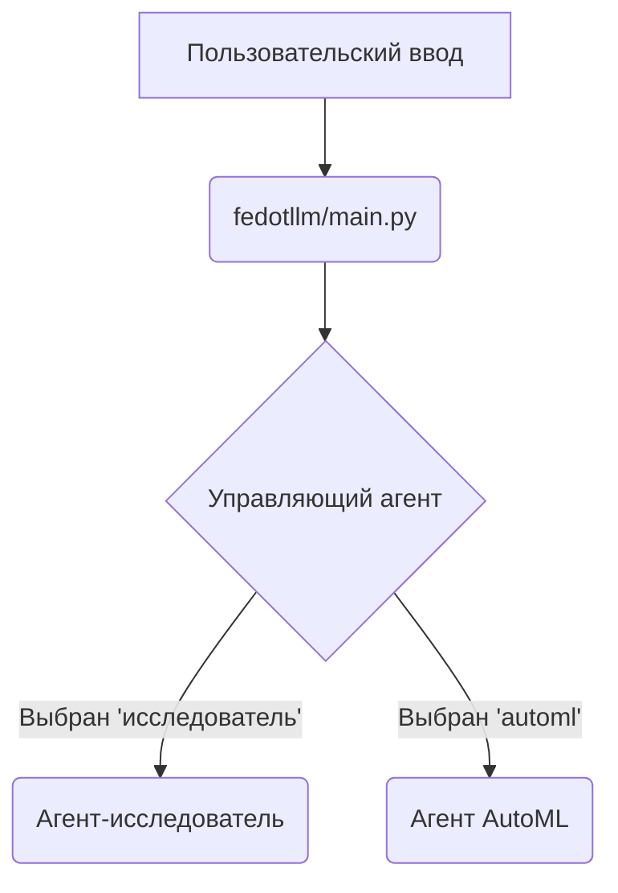
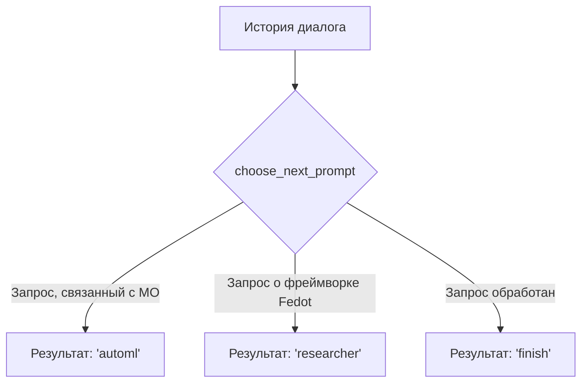
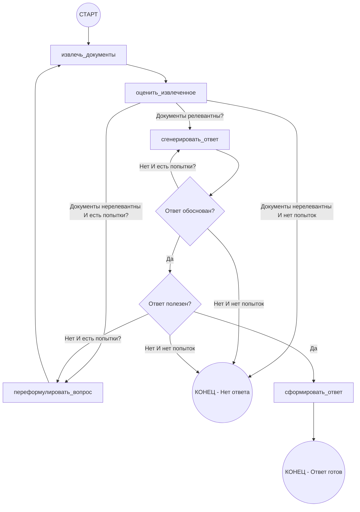
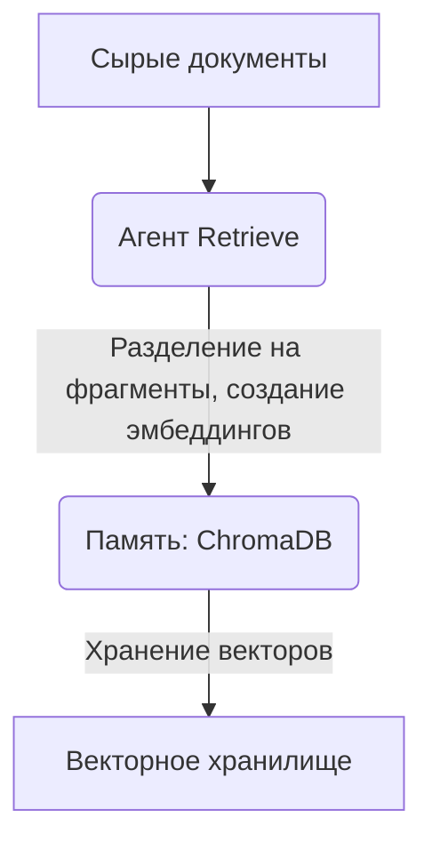
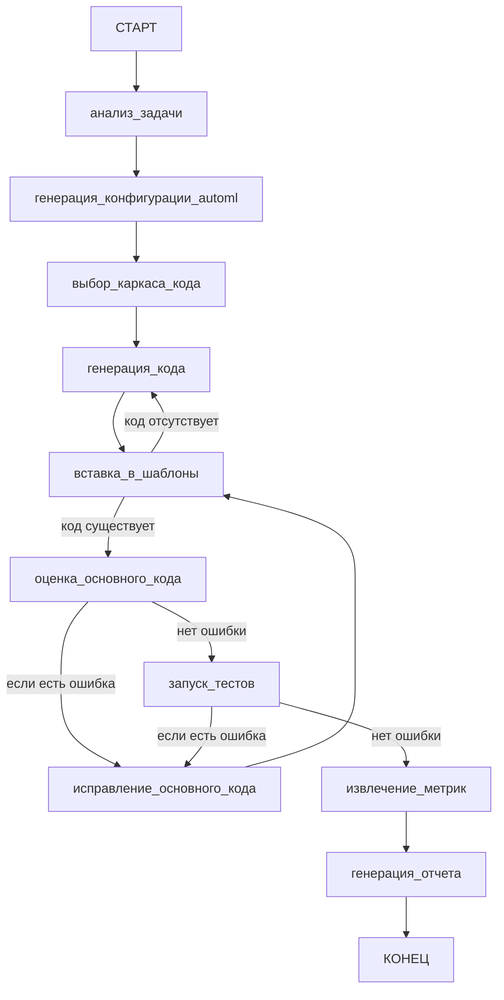
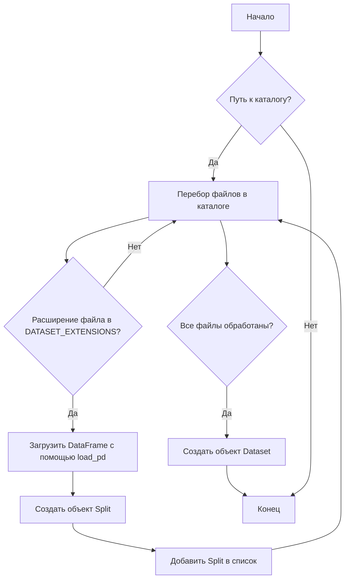
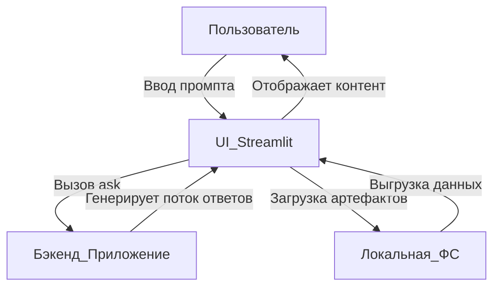
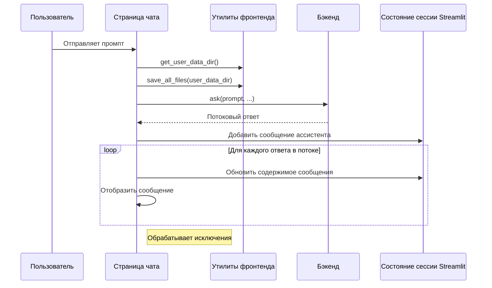
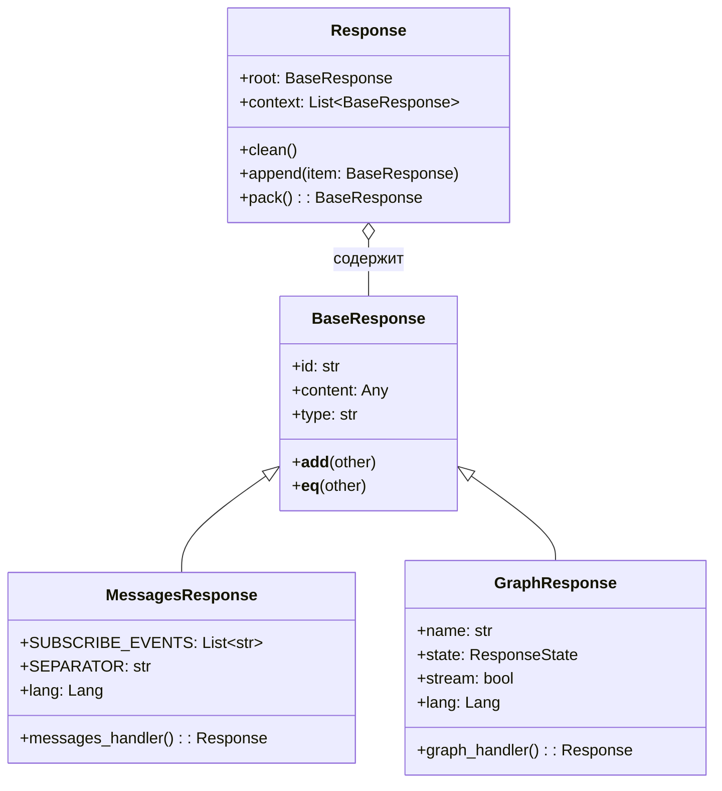
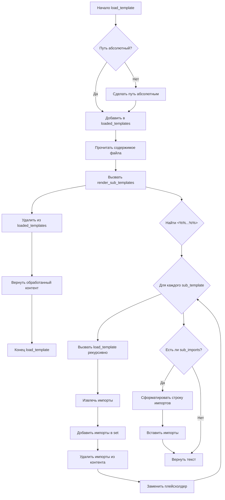

# Документация по FEDOT.LLM

<div align="center">

[](https://github.com/aimclub/FEDOT.LLM/blob/main/docs/wiki-ru.md) 
[](https://github.com/aimclub/FEDOT.LLM/blob/main/docs/wiki-eng.md)

</div>

---

## Содержание

- [Обзор проекта](#project-overview)
- [Установка и настройка](#installation-setup)
  - [Базовая установка](#basic-installation)
    - [Способ 1: С помощью uv (рекомендуется)](#method-1-using-uv-recommended)
    - [Способ 2: С помощью conda](#method-2-using-conda)
  - [Конфигурация окружения](#environment-configuration)
    - [Настройка API-ключей](#setting-up-api-keys)
- [Общая архитектура системы](#overall-system-architecture)
  - [Основной поток выполнения приложения](#main-application-flow)
  - [Агентная система](#agent-system)
    - [Управляющий агент (Supervisor)](#supervisor-agent)
    - [Агент-исследователь (Researcher)](#researcher-agent)
    - [Управление данными и память](#data-management-and-memory)
    - [Агент AutoML](#automl-agent)
      - [Основной рабочий процесс и архитектура](#core-workflow-and-architecture)
      - [Формирование отчетов и обработка вывода](#reporting-and-output-handling)
        - [Структура промпта для отчета AutoML](#automl-report-prompt-structure)
- [Загрузка и представление данных](#data-loading-and-representation)
    - [Поддерживаемые форматы файлов](#supported-file-formats)
    - [Структура набора данных](#dataset-structure)
    - [Процесс загрузки данных](#data-loading-process)
- [Веб-интерфейс на Streamlit](#streamlit-web-interface)
  - [Обзор архитектуры](#architecture-overview)
  - [Ключевые компоненты и страницы](#key-components-and-pages)
    - [Интерфейс чата (fedotllm/web/frontend/pages/chat.py)](#chat-interface-fedotllmwebfrontendpageschatpy)
    - [Вспомогательные функции фронтенда (fedotllm/web/frontend/utils/__init__.py)](#frontend-utility-functions-fedotllmwebfrontendutils__init__py)
    - [Обработка ответов и их типы (fedotllm/web/common/types.py)](#response-handling-and-types-fedotllmwebcommontypespy)
    - [Визуализация графов (fedotllm/web/frontend/components/st_graph/frontend/main.js)](#graph-visualization-fedotllmwebfrontendcomponentsst_graphfrontendmainjs)
- [Система шаблонов](#template-system)
  - [Основная обработка шаблонов](#core-template-processing)
    - [Загрузка шаблонов и разрешение вложенных шаблонов](#template-loading-and-sub-template-resolution)
    - [Вспомогательные функции для обработки шаблонов](#helper-functions-for-template-processing)
    - [Типы плейсхолдеров](#placeholder-types)
  - [Рендеринг шаблона](#template-rendering)


## Обзор проекта

### Связанные разделы

Связанные темы: [Установка и настройка](#installation-setup)


# Обзор проекта

FEDOT.LLM — это проект, предназначенный для использования больших языковых моделей (LLM) для решения задач автоматического машинного обучения (AutoML). Он объединяет различные компоненты, включая агентов для выполнения конкретных задач, утилиты для обработки данных, систему управления промптами и локальную среду выполнения для реализации сложных рабочих процессов машинного обучения и интерактивного решения задач. Система нацелена на упрощение процесса построения и оценки моделей МО, а также на предоставление обоснованных ответов на основе документации.

Ядро FEDOT.LLM основано на интеллектуальных агентах, которые взаимодействуют с LLM, управляют данными и выполняют код в изолированных средах. Такая структура обеспечивает динамическую адаптацию к требованиям задачи и итеративное улучшение решений, что демонстрируется в его исследовательских и AutoML-функциях.

# Установка и настройка

## Базовая установка
### Способ 1: С помощью uv (рекомендуется)

1. Установите uv (быстрый установщик и сопоставитель зависимостей для пакетов Python):

```bash
curl -LsSf https://astral.sh/uv/install.sh | sh
```

2. Клонируйте репозиторий:

```bash
git clone https://github.com/aimclub/FEDOT.LLM.git
cd FEDOT.LLM
```

3. Создайте и активируйте новое виртуальное окружение:

```bash
uv venv --python 3.10
source .venv/bin/activate  # Для Unix/macOS
# Или для Windows:
# .venv\Scripts\activate
```

4. Установите зависимости:

```bash
uv sync
```

### Способ 2: С помощью conda

1. Создайте новое окружение conda:

```bash
conda create -n FedotLLM python=3.10
conda activate FedotLLM
```

2. Клонируйте репозиторий:

```bash
git clone https://github.com/aimclub/FEDOT.LLM.git
cd FEDOT.LLM
```

3. Установите зависимости:

```bash
pip install -e .
```

## Конфигурация окружения
### Настройка API-ключей
FEDOT.LLM требует API-ключ для доступа к сервисам LLM. Ключ необходимо настроить с помощью переменных окружения.

Создайте файл `.env` в корневом каталоге проекта или установите переменные окружения напрямую:
```bash
export FEDOTLLM_LLM_API_KEY=ваш_api_ключ_для_llm
export FEDOTLLM_EMBEDDINGS_API_KEY=ваш_api_ключ_для_эмбеддингов

# Опционально: Для трассировки вызовов LLM с помощью Langfuse
export LANGFUSE_SECRET_KEY=ваш_секретный_ключ_langfuse
export LANGFUSE_PUBLIC_KEY=ваш_публичный_ключ_langfuse
```

# Общая архитектура системы

Проект FEDOT.LLM спроектирован как интеллектуальный ИИ-ассистент, способный обрабатывать как запросы, связанные с документацией, так и задачи автоматического машинного обучения (AutoML). Его архитектура является агентной и использует большие языковые модели (LLM) для обработки запросов на естественном языке, генерации ответов и оркестрации сложных рабочих процессов. Система имеет модульную структуру, в которой логика разделена на отдельных агентов, определения промптов, модули управления данными и среды выполнения, что обеспечивает масштабируемость и поддерживаемость.

В своей основе FEDOT.LLM маршрутизирует запросы пользователя через центрального управляющего агента (`Supervisor`) к специализированным подагентам, таким как агент-исследователь (`Researcher`) для запросов к документации или `AutoML-агент` для задач машинного обучения. Такая структура позволяет создать гибкую и расширяемую систему, в которую можно интегрировать новые возможности в виде дополнительных агентов. Система также включает надежные механизмы обработки данных, в том числе векторную память для извлечения контекста и изолированную среду (песочницу) для выполнения сгенерированного кода.

## Основной поток выполнения приложения

Основной поток выполнения приложения начинается с взаимодействия с пользователем, как правило, через веб-интерфейс, где принимаются входные данные, такие как загруженные файлы и описания задач. Скрипт `main.py` управляет общим процессом, инициализируя LLM и рабочий процесс агента. Сообщения пользователя обрабатываются, и вызывается `управляющий агент` (Supervisor) для определения соответствующего последующего действия на основе истории диалога. Это решение определяет, какой специализированный агент (например, Researcher или AutoML) будет обрабатывать запрос.

Ниже представлена высокоуровневая схема основного потока выполнения системы:



## Агентная система

Архитектура FEDOT.LLM построена на системе специализированных агентов, каждый из которых отвечает за определенный набор задач.

### Управляющий агент (Supervisor)

`Управляющий агент` выступает в роли центрального механизма маршрутизации, анализируя историю диалога для определения того, какой специализированный агент должен обработать текущий запрос пользователя. Он оценивает сообщения и решает, относится ли задача к общему исследованию/документации (`researcher`), автоматическому машинному обучению (`automl`), или же диалог завершен (`finish`).

Логика принятия решений инкапсулирована в функции `choose_next_prompt`, которая принимает сообщения диалога в качестве входных данных и возвращает одно из предопределенных действий.

Рабочий процесс `управляющего агента` можно визуализировать следующим образом:


Источники: [fedotllm/prompts/supervisor.py:1-32](https://github.com/aimclub/FEDOT.LLM/blob/main/fedotllm/prompts/supervisor.py#L1-L32)

### Агент-исследователь (Researcher)

`Агент-исследователь` предназначен для ответов на вопросы пользователя путем извлечения релевантной информации из предоставленной документации и генерации обоснованных ответов. Его рабочий процесс включает несколько шагов: генерация первоначального ответа, проверка на обоснованность (наличие галлюцинаций), оценка полезности и, возможно, переформулирование вопроса для улучшения поиска информации.

Рабочий процесс `агента-исследователя`, определенный в [`fedotllm/agents/researcher/researcher.py`](https://github.com/aimclub/FEDOT.LLM/blob/main/fedotllm/agents/researcher/researcher.py) и реализованный в [`fedotllm/agents/researcher/nodes.py`](https://github.com/aimclub/FEDOT.LLM/blob/main/fedotllm/agents/researcher/nodes.py), включает несколько шагов для обеспечения высокого качества и обоснованности ответа:



*   **`rewrite_question`**: Переформулирует вопрос для повышения эффективности извлечения информации. 
*   **`retrieve`**: Извлекает релевантные документы на основе (возможно, переформулированного) вопроса.
*   **`grade_retrieve`**: Оценивает качество извлеченных документов, проверяя их релевантность к вопросу. Если документы нерелевантны и есть счетчик попыток, инициируется переформулирование вопроса.
*   **`generate_response`**: Объединяет извлеченные документы и вопрос для генерации первоначального ответа.
*   **`is_grounded`**: Оценивает, подтверждается ли сгенерированный ответ извлеченными документами. Этот шаг помогает предотвратить галлюцинации.
*   **`is_useful`**: Оценивает полезность и релевантность сгенерированного ответа на исходный вопрос.
*   **`render_answer`**: Форматирует окончательный ответ, включая цитаты из документации.
*   **`is_continue`**: Условный узел, который увеличивает счетчик попыток.

#### Управление данными и память

Управление данными в FEDOT.LLM имеет решающее значение для предоставления контекстно-зависимых ответов. Компонент `Memory`, реализованный с помощью `ChromaDB`, служит векторной базой данных для хранения и извлечения фрагментов документов. Агент `Retrieve` отвечает за обработку сырых документов, их разделение на фрагменты (чанки), генерацию векторных представлений (эмбеддингов) и их вставку в это векторное хранилище.

Взаимодействие между `Retrieve` и `Memory` можно представить следующим образом:


Источники: [fedotllm/agents/retrieve.py:1-42](https://github.com/aimclub/FEDOT.LLM/blob/main/fedotllm/agents/retrieve.py#L1-L42), [fedotllm/agents/memory.py:4-31](https://github.com/aimclub/FEDOT.LLM/blob/main/fedotllm/agents/memory.py#L4-L31)


### Агент AutoML

Агент AutoML в проекте FEDOT.LLM предназначен для автоматизации процесса создания и выполнения пайплайнов машинного обучения на основе запросов пользователя. Его основная цель — интерпретировать описание задачи, генерировать соответствующие конфигурации AutoML, создавать исполняемый код, оценивать его производительность и, наконец, формировать подробный отчет с интерпретацией решения. Этот агент является ключевым компонентом для решения задач автоматического машинного обучения.

Агент работает по определенному рабочему процессу, обрабатывая ввод пользователя через серию взаимосвязанных шагов, от первоначального понимания задачи до генерации итогового отчета.

#### Основной рабочий процесс и архитектура

`AutoMLAgent` определяет последовательный рабочий процесс для управления процессом автоматического машинного обучения. Этот процесс, подобен конечному автомату, что обеспечивает выполнение шагов в логическом порядке со встроенными механизмами обработки ошибок и итераций.

Источники: [fedotllm/agents/automl/automl.py:1-33](https://github.com/aimclub/FEDOT.LLM/blob/main/fedotllm/agents/automl/automl.py#L1-L33)

Рабочий процесс включает в себя отдельные этапы, такие как анализ задачи, генерация конфигурации, создание кода, его выполнение, тестирование и формирование отчета.


Этапы рабочего процесса:
*   **`problem_reflection`**: Первоначальный анализ описания задачи.
*   **`generate_automl_config`**: Создает конфигурацию AutoML на основе анализа.
*   **`select_skeleton`**: Выбирает каркас кода для решения.
*   **`generate_code`**: Генерирует фактический код Python для пайплайна МО.
*   **`insert_templates`**: Интегрирует сгенерированный код в шаблоны. Если код `None`, возвращается к `generate_code`.
*   **`evaluate_main`**: Выполняет основную часть сгенерированного кода. При обнаружении ошибки (условие `if_bug`), переходит к `fix_solution_main`.
*   **`fix_solution_main`**: Пытается исправить ошибки в решении и возвращается к `insert_templates` для повторной оценки.
*   **`run_tests`**: Выполняет тесты для сгенерированного кода. При обнаружении ошибки переходит к `fix_solution_main`.
*   **`extract_metrics`**: Извлекает метрики производительности из выполненного решения.
*   **`generate_report`**: Составляет итоговый отчет на основе метрик и процесса.
Источники: [fedotllm/agents/automl/automl.py:21-33](https://github.com/aimclub/FEDOT.LLM/blob/main/fedotllm/agents/automl/automl.py#L21-L33)


#### Формирование отчетов и обработка вывода

После извлечения метрик, агент генерирует подробный отчет. Этот отчет структурируется в соответствии с определенным промптом, заданным в [`fedotllm/prompts/automl.py`](https://github.com/aimclub/FEDOT.LLM/blob/main/fedotllm/prompts/automl.py).

##### Структура промпта для отчета AutoML

Промпт `generate_report` направляет языковую модель при создании подробного отчета о решении AutoML. Он определяет несколько разделов и требуемую информацию, включая обзор задачи, сводку по пайплайну, ключевые фрагменты кода, метрики и основные выводы.

| Раздел                   | Описание |
|--------------------------|-------------|
| Обзор задачи             | Краткое изложение решаемой проблемы, включая ключевые детали и контекст. |
| Обзор пайплайна          | Обзор сгенерированного пайплайна МО, включая основные компоненты и их роли. |
| Ключевые фрагменты кода  | Важные участки кода, иллюстрирующие ключевые аспекты решения. |
| Метрики                  | Метрики производительности и результаты оценки из процесса AutoML. |
| Основные выводы          | Важные инсайты и заключения, сделанные в ходе процесса AutoML. |


Источники: [fedotllm/prompts/automl.py:1-58](https://github.com/aimclub/FEDOT.LLM/blob/main/fedotllm/prompts/automl.py#L1-L58)

---


# Загрузка и представление данных

Модуль `fedotllm.data` отвечает за абстрагирование сложностей загрузки данных и их единообразное представление в экосистеме FEDOT.LLM. Он поддерживает множество распространенных форматов табличных данных.

## Поддерживаемые форматы файлов

Система определяет набор распознаваемых расширений файлов для наборов данных, что позволяет автоматически их идентифицировать и обрабатывать.

| Категория  | Расширения                             |
| :--------- | :------------------------------------- |
| CSV        | `.csv`                                 |
| Parquet    | `.parquet`, `.pq`                      |
| Excel      | `.xls`, `.xlsx`, `.xlsm`, `.xlsb`, `.odf`, `.ods`, `.odt` |
| ARFF       | `.arff`                                |

Константа `DATASET_EXTENSIONS` объединяет все эти поддерживаемые расширения.

Источники: [fedotllm/constants.py:7](https://github.com/aimclub/FEDOT.LLM/blob/main/fedotllm/constants.py#L7)


## Структура набора данных

Класс `Dataset` инкапсулирует один или несколько объектов `Split`, каждый из которых представляет DataFrame из файла.
Источники: [fedotllm/data/data.py:1-24](https://github.com/aimclub/FEDOT.LLM/blob/main/fedotllm/data/data.py#L1-L24)

## Процесс загрузки данных

Следующая диаграмма иллюстрирует общий процесс загрузки данных в модуле `fedotllm.data`.



Источники: [fedotllm/data/data.py:1-9](https://github.com/aimclub/FEDOT.LLM/blob/main/fedotllm/data/data.py#L1-L9)


# Веб-интерфейс на Streamlit

Проект FEDOT.LLM предоставляет интерактивный веб-интерфейс, созданный с помощью Streamlit, который обеспечивает удобное взаимодействие с системой. Этот интерфейс позволяет пользователям описывать свои задачи машинного обучения, загружать наборы данных, получать сгенерированные ИИ решения и скачивать различные выходные артефакты. Он служит основным графическим пользовательским интерфейсом для системы FEDOT.LLM.

Веб-интерфейс интегрирует компоненты для взаимодействия в чате, динамического рендеринга контента, управления файлами.
## Обзор архитектуры

Веб-интерфейс Streamlit работает, запуская локальный веб-сервер, который обслуживает приложение. Взаимодействия пользователя в браузере вызывают функции Python, определенные в приложении Streamlit, которые, в свою очередь, взаимодействуют с бэкенд-компонентами FEDOT.LLM. Фронтенд-страницы, такие как интерфейс чата и боковая панель, используют общие вспомогательные функции для обработки файлов и управления данными. Ответы от ИИ-системы обрабатываются и отображаются динамически.

Основной поток взаимодействия включает в себя ввод промпта пользователем, который затем отправляется в функцию `ask` на бэкенде. Бэкенд обрабатывает запрос и потоково передает ответы на фронтенд, где они отображаются.



## Ключевые компоненты и страницы

Веб-интерфейс Streamlit состоит из нескольких ключевых страниц и вспомогательных модулей, которые в совокупности обеспечивают его функциональность.

### Интерфейс чата ([`fedotllm/web/frontend/pages/chat.py`](https://github.com/aimclub/FEDOT.LLM/blob/main/fedotllm/web/frontend/pages/chat.py))

Файл `chat.py` определяет основной диалоговый интерфейс, где пользователи взаимодействуют с системой FEDOT.LLM. Асинхронная функция `handle_predict` является центральной для обработки пользовательских промптов и отображения ответов ИИ. Она управляет состоянием сессии для сообщений и динамически отображает потоковый контент.

Функция `handle_predict` выполняет следующую последовательность операций:

Источники: [fedotllm/web/frontend/pages/chat.py:10-33](https://github.com/aimclub/FEDOT.LLM/blob/main/fedotllm/web/frontend/pages/chat.py#L10-L33)


### Вспомогательные функции фронтенда ([`fedotllm/web/frontend/utils/__init__.py`](https://github.com/aimclub/FEDOT.LLM/blob/main/fedotllm/web/frontend/utils/__init__.py))

Этот модуль объединяет различные вспомогательные функции, используемые во всем фронтенде Streamlit. Эти функции в основном занимаются операциями с файловой системой, управлением сессиями и обработкой данных.

| Название функции        | Описание                                                                    |
|-------------------------|-----------------------------------------------------------------------------|
| `get_user_data_dir`     | Получает путь к каталогу для данных конкретного пользователя.               |
| `clear_directory`       | Очищает содержимое указанного каталога.                                     |
| `save_all_files`        | Сохраняет все загруженные файлы в указанный каталог.                        |
| `get_hash_key`          | Генерирует хэш-ключ для идентификации сессии.         |
| `file_uploader`         | Обертка для компонента Streamlit для загрузки файлов.                       |
| `create_zip_file`       | Сжимает каталог или файлы в zip-архив.                                      |
| `get_user_uploaded_files`| Получает список файлов, загруженных пользователем.                         |
| `get_user_session_id`   | Получает идентификатор текущей сессии пользователя.                         |
| `generate_output_file`  | Генерирует определенный выходной файл для сабмита.               |
| `render`                | Отображает контент, в частности объекты `BaseResponse`, в UI.               |

### Обработка ответов и их типы ([`fedotllm/web/common/types.py`](https://github.com/aimclub/FEDOT.LLM/blob/main/fedotllm/web/common/types.py))

Файл `types.py` определяет структуры данных, используемые для коммуникации и представления контента в системе FEDOT.LLM, особенно для ответов, передаваемых потоком на фронтенд. Ключевые классы включают `BaseResponse`, `Response` и `MessagesHandler`.
Источники: [fedotllm/web/common/types.py:1-62](https://github.com/aimclub/FEDOT.LLM/blob/main/fedotllm/web/common/types.py#L1-L62)



Источники: [fedotllm/web/common/types.py:1-62]()

`BaseResponse` служит фундаментальной единицей для потокового контента, позволяя инкрементально обновлять и сравнивать части ответа. Класс `Response` является контейнером для корневого ответа и списка контекстных ответов, предоставляя методы для их управления и упаковки. `MessagesResponse` и `GraphResponse` расширяет `BaseResponse` и обрабатывают конкртные типы событий (сообщения, либо обновления графа).

Источники: [fedotllm/web/common/types.py:1-62](https://github.com/aimclub/FEDOT.LLM/blob/main/fedotllm/web/common/types.py#L1-L62)

### Визуализация потока выполнения

FEDOT.LLM использует библиотеку `graphviz` для визуализации потока выполнения

Источники: [fedotllm/web/frontend/components/st_graph/frontend/main.js:1-32]()

# Система шаблонов

Проект FEDOT.LLM включает в себя гибкую систему шаблонов. Эта система позволяет проекту отделять статический контент от динамических переменных, обеспечивая гибкие и повторно используемые структуры. Она обрабатывает вложенные шаблоны, агрегирует инструкции импорта и сохраняет отступы в коде, гарантируя, что сгенерированный вывод будет синтаксически корректным и читаемым.

## Основная обработка шаблонов

Ядро системы шаблонов находится в `load_template.py`, который предоставляет функциональность для загрузки файлов шаблонов, разрешения вложенных шаблонов и управления инструкциями импорта в Python. Это гарантирует, что сложные шаблоны, состоящие из более мелких, повторно используемых частей, правильно собираются в единый, целостный вывод.

### Загрузка шаблонов и разрешение вложенных шаблонов

Функция `load_template` отвечает за чтение файла шаблона из файловой системы, обработку любых вложенных в него шаблонов и управление циклическими зависимостями. Она использует `render_sub_templates` для выполнения фактической подстановки и агрегации импортов. 

Источники: [fedotllm/agents/automl/templates/load_template.py:100-125]()


Функция `render_sub_templates` является основным механизмом для замены плейсхолдеров вложенных шаблонов (например, `<%% template_name %%>`) их соответствующим содержимым. Она рекурсивно загружает вложенные шаблоны, извлекает их инструкции импорта, а затем удаляет их из содержимого вложенного шаблона перед вставкой. Извлеченные импорты затем агрегируются и вставляются в начало окончательного обработанного контента. 

Источники: [fedotllm/agents/automl/templates/load_template.py:53-97]()


Общая схема обработки файла шаблона выглядит следующим образом:


Источники: [fedotllm/agents/automl/templates/load_template.py:53-125](https://github.com/aimclub/FEDOT.LLM/blob/main/fedotllm/agents/automl/templates/load_template.py#L53-L125)

### Вспомогательные функции для обработки шаблонов

Несколько вспомогательных функций поддерживают основную логику обработки шаблонов:

*   `_extract_imports(content: str) -> Set[str]`: Находит и извлекает инструкции `import` и `from ... import` с помощью регулярного выражения. Источники: [fedotllm/agents/automl/templates/load_template.py:99-105](https://github.com/aimclub/FEDOT.LLM/blob/main/fedotllm/agents/automl/templates/load_template.py#L99-L105)
*   `_remove_imports(content: str, imports: Set[str]) -> str`: Удаляет найденные инструкции импорта из контента. Источники: [fedotllm/agents/automl/templates/load_template.py:107-115](https://github.com/aimclub/FEDOT.LLM/blob/main/fedotllm/agents/automl/templates/load_template.py#L107-L115)
*   `_replace_placeholder_with_content(text: str, placeholder: str, content: str) -> str`: Заменяет определенный плейсхолдер (`<%% placeholder %%>`) в тексте предоставленным контентом, критически важно сохраняя исходный отступ плейсхолдера. Источники: [fedotllm/agents/automl/templates/load_template.py:175-195](https://github.com/aimclub/FEDOT.LLM/blob/main/fedotllm/agents/automl/templates/load_template.py#L175-L195)
*   `_insert_imports(text: str, imports_str: str) -> str`: Вставляет агрегированные инструкции импорта в начало текста, после любых начальных комментариев. Источники: [fedotllm/agents/automl/templates/load_template.py:197-210](https://github.com/aimclub/FEDOT.LLM/blob/main/fedotllm/agents/automl/templates/load_template.py#L197-L210)

### Типы плейсхолдеров

Система шаблонов использует два основных типа плейсхолдеров для разных целей:

| Тип плейсхолдера     | Назначение                                              | Исходный файл                                  |
| :------------------- | :------------------------------------------------------ | :------------------------------------------- |
| `<%% template_name %%>` | Для загрузки и вставки контента из файлов вложенных шаблонов. | [fedotllm/agents/automl/templates/load_template.py:59](https://github.com/aimclub/FEDOT.LLM/blob/main/fedotllm/agents/automl/templates/load_template.py#L59) |
| ``          | Для прямой подстановки переменных в строковом шаблоне.  | [fedotllm/agents/automl/templates/load_template.py:221](https://github.com/aimclub/FEDOT.LLM/blob/main/fedotllm/agents/automl/templates/load_template.py#L221) |

## Рендеринг шаблона

Помимо загрузки шаблонов из файлов, система также предоставляет функцию `render_template` для замены простых плейсхолдеров переменных (например, ``) в заданной строке-шаблоне. Это используется для прямого форматирования строк, когда загрузка из файла не требуется.

Источники: [fedotllm/agents/automl/templates/load_template.py:212-237](https://github.com/aimclub/FEDOT.LLM/blob/main/fedotllm/agents/automl/templates/load_template.py#L212-L237)